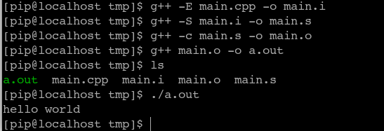

# Linux可执行文件的生成

## 参考链接

https://blog.csdn.net/K346K346/article/details/52040256

## 过程

`预编译   --->   编译   --->   汇编   ---> 链接`

第一步：`g++ -E main.cpp -o main.i`

第二步：`g++ -S main.i -o main.s`

第三步：`g++ -c main.s -o main.o`

第四步：`g++ main.o -o a.out`

## 每步的作用和发生的事情

*   第一步：预编译，去除注释和进行宏替换，即替换`#define`，条件编译；
*   第二步：编译，生成汇编程序，并进行语法检查；
*   第三步：汇编，生成机器可识别的目标代码；
*   第四步：链接，将目标代码链接生成可执行文件．

