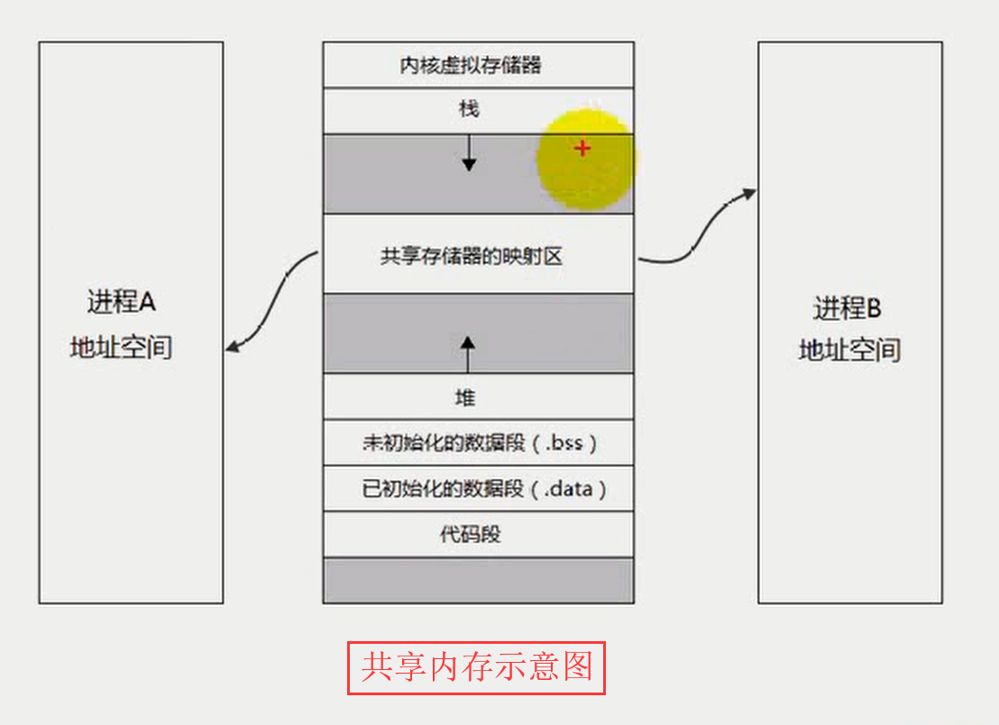
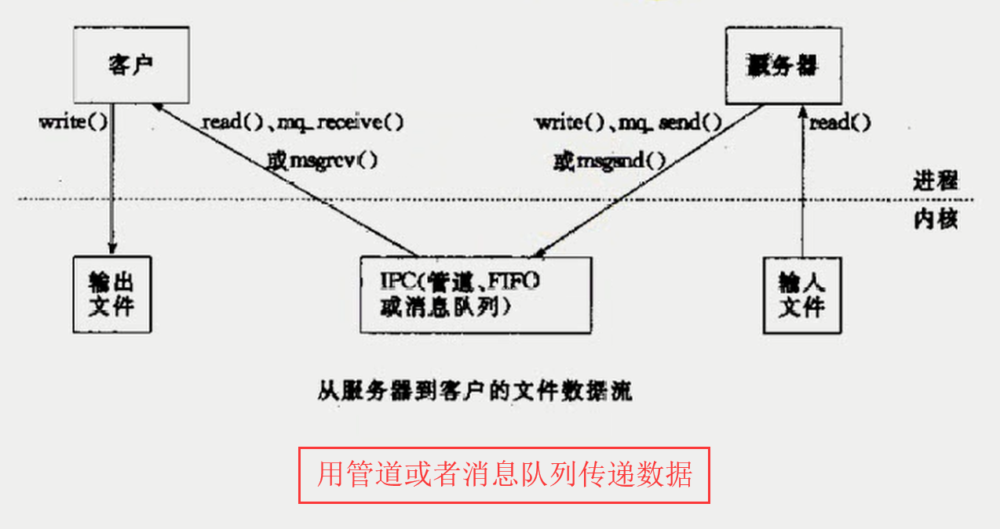

# day06

## 本章目标

* 共享内存
* 共享内存示意图
* 管道、消息队列与共享内存传递数据对比
* `mmap`函数
* `munmap`函数
* `msync`函数

## 共享内存

> 共享内存区是最快的`IPC`形式，一旦这样的内存映射到共享它的进程的地址空间，这些进程间数据传递不再涉及到内核，换句话说是进程不再通过执行进入内核的系统调用来传递彼此的数据。

## 共享内存示意图

>没有内存拷贝、但有两次内核交互。



## 管道消息队列传递数据示意图

> 一共四次内存拷贝和四次与内核的交互。



## mmap函数

> * 功能：`man mmap`，通过`ipcs`来查看共享内存，在`System V`的消息队列中说过`ipcs`的这个命令，可自行查看。将文件或者设备空间映射到共享内存区，内存的申请是以页面为单位的，查了下`linux的一个内存页面默认为4K`内存页的大小不固定，根据内存变化的。[跳转链接](https://www.zhihu.com/question/26402946/answer/274097035)
>
> * 原型：
>
>   * `void * mmap(void *addr, size_t len, int prot, int flags, int fd, off_t offset);`
>
> * 参数：
>
>   * `addr`：要映射的起始地址，通常指定为NULL，让内核自动选择
>
>   * `len`：映射到进程地址空间的字节数
>
>   * `prot`：映射区保护方式
>
>     ```
>     PROT_EXEC  Pages may be executed.//可执行
>     PROT_READ  Pages may be read.//可读
>     PROT_WRITE Pages may be written.//可写
>     PROT_NONE  Pages may not be accessed.//不可访问
>     ```
>
>   * `flags`：标志
>
>     > 标志还有很多可以自行`man mmap`
>
>     ```
>     MAP_SHARED		变动是共享的
>     MAP_PRIVATE		变动是私有的，变化的内容不会写回到文件中
>     MAP_FIXED		准确解释addr参数，当第一个参数是自己指定的地址时，可能自己指定的地址不是页面的整数倍，则没有内存页面对齐，则此参数会自动对齐到页面的整数倍。指定的地址如果没有办法进行映射，加了此参数后会返回一个NULL。如果指定的地址没有办法进行映射，而且没有指定该参数，则内核会去找一个，地址进行映射并返回。
>     MAP_ANONYMOUS	建立匿名映射区，不涉及文件，只是创建内存映射区，不把文件映射过来。只能用于具有亲缘的进程之间进行通信。
>     ```
>
>   * `fd`：文件描述符
>
>   * `offset`：从文件头开始的偏移量
>
> * 返回值：成功返回映射到的内存区的起始地址；失败返回`-1`

## munmap函数

> * 功能：取消内存映射
> * 原型：
>   * `int munmap(void *addr, size_t length);`
> * 参数：
>   * `addr`：映射的内存起始地址
>   * `len`：映射到进程地址空间的字节数
> * 返回值：成功返回`0`，失败返回`-1`

## map注意点

> * 映射不能改变文件的大小
> * 可用于进程间通信的有效地址空间不完全受限被映射文件的大小
> * 文件一旦被映射后，所有对映射区域的访问实际上是对内存区域的访问。映射区域内容写回文件时，所写内容不能超过文件的大小。

## msync函数

> * 功能：对映射内存执行同步操作，因为对映射到内存的文件进行操作后，不会立即修改文件，因为内核会在一个合适的时机进行对文件修改，而`msync`函数则是让内核直接把共享内存的改变同步到文件中。
>
> * 原型：
>
>   * `int msync(void * addr, size_t len, int flags);`
>
> * 参数：
>
>   * `addr`：内存起始地址
>
>   * `len`：长度
>
>   * `flags`：选项
>
>| flags         | 说明                                                         |
>| ------------- | ------------------------------------------------------------ |
>| MS_ASYNC      | 执行异步写操作                                               |
>| MS_SYNC       | 执行同步写操作，执行写操作完毕后这个函数才会返回。           |
>| MS_INVALIDATE | 使高速缓存的数据失效，使得其他映射这个内存的进程映射失效。则其他进程下一次访问数据时需要重新获取最新值。 |
>
> * 返回值：成功返回`0`；失败返回`-1`

## od

> 格式化输出文件中的数据
>
> 常用`od -c filename`，输出的最左边的标号是`16`进制的，且如果中间多个零则会用`*`简略表示
>
> 更多详情[点击查看](https://blog.csdn.net/shylock_backer/article/details/46473283)
