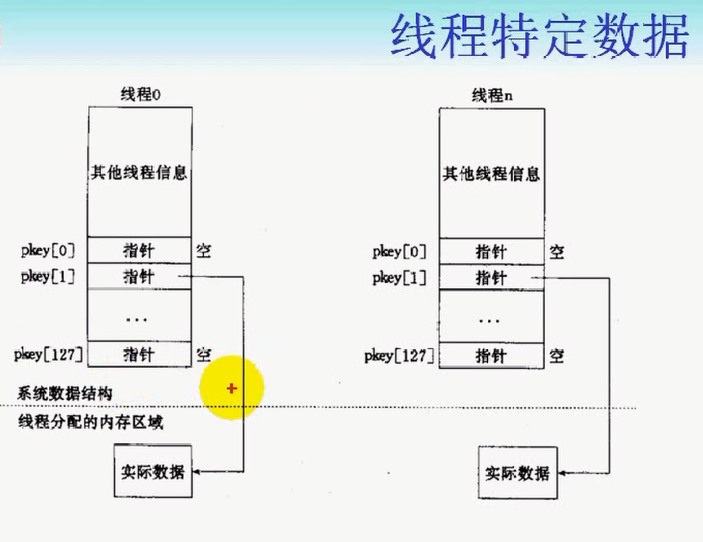

# day16

## 本章目标

* 线程属性
* 线程特定数据


## 线程属性

> * 初始化与销毁属性
>
>   ```
>   #include <pthread.h>
>
>   int pthread_attr_init(pthread_attr_t *attr);
>   int pthread_attr_destroy(pthread_attr_t *attr);
>
>   Compile and link with -pthread.
>   ```
>
> * 获取与设置分离属性
>
>   ```
>   #include <pthread.h>
>
>   int pthread_attr_setdetachstate(pthread_attr_t *attr, int detachstate);
>   int pthread_attr_getdetachstate(pthread_attr_t *attr, int *detachstate);
>
>   Compile and link with -pthread.
>   ```
>
>   * `pthread_attr_getdetachstate`的参数二的取值
>
>     ```
>     PTHREAD_CREATE_DETACHED//线程的属性是分离的
>     Threads that are  created  using  attr  will  be  created  in  a detached state.
>
>     PTHREAD_CREATE_JOINABLE//线程的属性不是分离的，默认属性，避免出现僵线程。
>     Threads  that  are created using attr will be created in a join‐ able state.
>     ```
>
> * 获取与设置栈大小
>
>   ```
>   #include <pthread.h>
>
>   int pthread_attr_setstacksize(pthread_attr_t *attr, size_t stacksize);//设置当前栈大小，指定为0，使用系统的栈默认大小。
>   int pthread_attr_getstacksize(pthread_attr_t *attr, size_t *stacksize);//获取当前栈大小
>
>   Compile and link with -pthread.
>   ```
>
> * 获取与设置栈溢出保护区大小
>
>   ```
>   #include <pthread.h>
>
>   int pthread_attr_setguardsize(pthread_attr_t *attr, size_t guardsize);
>   int pthread_attr_getguardsize(pthread_attr_t *attr, size_t *guardsize);
>
>   Compile and link with -pthread.
>   ```
>
> * 获取与设置线程竞争范围
>
>   ```
>   #include <pthread.h>
>
>   int pthread_attr_setscope(pthread_attr_t *attr, int scope);
>   int pthread_attr_getscope(pthread_attr_t *attr, int *scope);
>
>   Compile and link with -pthread.
>   ```
>
>   * 竞争范围
>
>     ```
>     PTHREAD_SCOPE_SYSTEM//系统范围内的竞争，默认锁
>     	The thread competes for resources with all other threads in  all processes  on the system that are in the same scheduling allocation   domain   (a   group   of   one   or   more   processors). PTHREAD_SCOPE_SYSTEM  threads  are  scheduled  relative  to  one another according to their scheduling policy and priority.
>
>     PTHREAD_SCOPE_PROCESS//线程范围内的竞争
>     	The thread competes for resources with all other threads in  the same    process    that    were    also    created    with   the PTHREAD_SCOPE_PROCESS contention  scope.   PTHREAD_SCOPE_PROCESS threads  are  scheduled relative to other threads in the process according to their scheduling policy and priority.  POSIX.1-2001 leaves  it  unspecified  how  these  threads  contend with other
>     threads in other process on the system or with other threads  in the same process that were created with the PTHREAD_SCOPE_SYSTEM contention scope.
>
>     ```
>
> * 获取与设置调度策略
>
>   ```
>   #include <pthread.h>
>
>   int pthread_attr_setschedpolicy(pthread_attr_t *attr, int policy);
>   int pthread_attr_getschedpolicy(pthread_attr_t *attr, int *policy);
>
>   Compile and link with -pthread.
>   ```
>
>   * 调度策略
>
>     ```
>     SCHED_FIFO：如果线程具有相同的优先级，则按照先进先出的原则调度
>     SCHED_RR：如果优先级相同，后面的线程可以抢占硬件资源
>     SCHED_OTHER：其他情况，默认
>     ```
>
> * 获取与设置继承的调度策略
>
>   ```
>   #include <pthread.h>
>
>   int pthread_attr_setinheritsched(pthread_attr_t *attr, int inheritsched);
>   int pthread_attr_getinheritsched(pthread_attr_t *attr, int *inheritsched);
>
>   Compile and link with -pthread.
>   ```
>
>   * 是否即成调度策略
>
>     ```
>     PTHREAD_INHERIT_SCHED//表示新创建的线程，将即成调用者的调度策略属性
>     	Threads  that  are  created  using   attr   inherit   scheduling attributes  from  the creating thread; the scheduling attributes in attr are ignored.
>
>     PTHREAD_EXPLICIT_SCHED//需自己通过pthread_attr_setinheritsched函数设置调度策略属性
>     	Threads that  are  created  using  attr  take  their  scheduling attributes from the values specified by the attributes object.
>     ```
>
> * 获取与设置调度参数
>
>   ```
>   #include <pthread.h>
>
>   int pthread_attr_setschedparam(pthread_attr_t *attr, const struct sched_param *param);
>   int pthread_attr_getschedparam(pthread_attr_t *attr, struct sched_param *param);
>
>   Compile and link with -pthread.
>
>   struct sched_param {
>   	int sched_priority;     /* Scheduling priority */调度优先级，默认为0。
>   };
>   ```
>
> * 获取与设置并发级别
>
>   > 仅在`N:M`线程模型中有效，设置并发级别，给内核一个提示：表示提供给定级别数量的核心线程来映射用户线程是高效的。
>
>   ```
>   #include <pthread.h>
>
>   int pthread_setconcurrency(int new_level);//不代表线程数；默认为0，表示内核按照自己合适的方式映射。
>   int pthread_getconcurrency(void);
>
>   Compile and link with -pthread.
>   ```

## 线程特定数据

> * 在单线程程序中，我们经常要用到"全局变量"以实现多个函数间共享数据。
> * 在多线程环境下，由于数据空间是共享的，因此全局变量也为所有线程所共有。
> * 但有时应用程序设计中有必要提供线程私有的全局变量，仅在某个线程中有效，但却可以跨多个函数访问。
> * `POSIX`线程库通过维护一定的数据结构来解决这个问题，这些数据称为(Thread-specific Data，或TSD)



## 线程特定数据相关函数

> 每个线程都有128个`pkey`如上图所示，每个`pkey`相当于每个线程的`局部全局变量`。即在线程内的私有全局变量不能被其他线程修改，但是可以让其他线程访问。

> ```
>  #include <pthread.h>
>
> //key的创建
> int pthread_key_create(pthread_key_t *key, void (*destructor)(void*));
> //key的删除
> int pthread_key_delete(pthread_key_t key);
>
> //获取key对应的地址的数据
> void *pthread_getspecific(pthread_key_t key);
> //设置key对应的地址的数据
> int pthread_setspecific(pthread_key_t key, const void *value);
>
> //代表这个init_routine函数的执行，只在第一个线程进入的时候执行一次
> int pthread_once(pthread_once_t *once_control, void (*init_routine)(void));
> pthread_once_t once_control = PTHREAD_ONCE_INIT;
> ```
>
> 