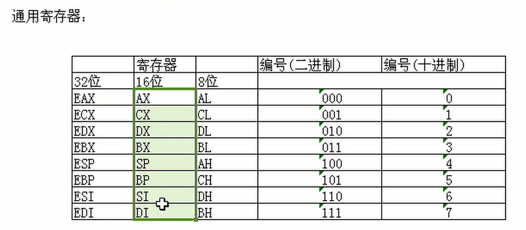
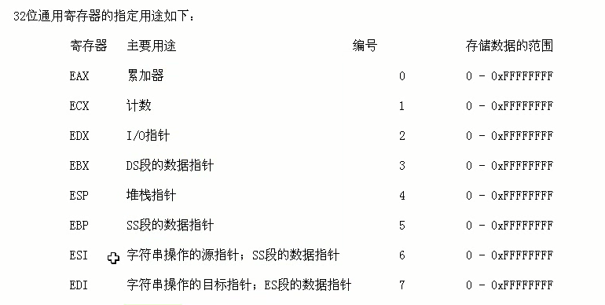

# 寄存器说明

* cs： 代码段寄存器，是 code segment 的缩写；segment :\[计算机\] (字符等的) 分段
* ds：数据段寄存器，是  data segment 的缩写；
* ss：堆栈段寄存器， 是 stack segment 的缩写；
* es：附加段寄存器，是 extra segment 的缩写；

> 寄存器的作用：https://blog.csdn.net/tiger_ibm/article/details/8750153

## 一般寄存器:AX、BX、CX、DX

> AX:累积暂存器，BX:基底暂存器，CX:计数暂存器，DX:资料暂存器

* 索引暂存器:SI、DI

> SI:来源索引暂存器，DI:目的索引暂存器

* 堆叠、基底暂存器:SP、BP

> SP:堆叠指标暂存器，BP:基底指标暂存器

> EAX、ECX、EDX、EBX：为ax,bx,cx,dx的延伸，各为32位元
>
> ESI、EDI、ESP、EBP：为si,di,sp,bp的延伸，32位

## 32\16\8位通用寄存器

## 32位通用寄存器

## 寄存器的具体作用

* EAX 是"累加器"(accumulator), 它是很多加法乘法指令的缺省寄存器。
* EBX 是"基地址"(base)寄存器, 在内存寻址时存放基地址。
* ECX 是计数器(counter), 是重复(REP)前缀指令和LOOP指令的内定计数器。
* EDX 则总是被用来放整数除法产生的余数。
* ESI/EDI分别叫做"源/目标索引寄存器"(source/destination index),因为在很多字符串操作指令中, DS:ESI指向源串,而ES:EDI指向目标串.
* EBP是"基址指针"(BASE POINTER), 它最经常被用作高级语言函数调用的"框架指针"(frame pointer). 在破解的时候,经常可以看见一个标准的函数起始代码:
* ESP 专门用作堆栈指针，被形象地称为栈顶指针，堆栈的顶部是地址小的区域，压入堆栈的数据越多，ESP也就越来越小。在32位平台上，ESP每次减少4字节。
* EIP 返回本次调用后，下一条指令的地址 ,通过jmp和call指令修改不能直接修改。

