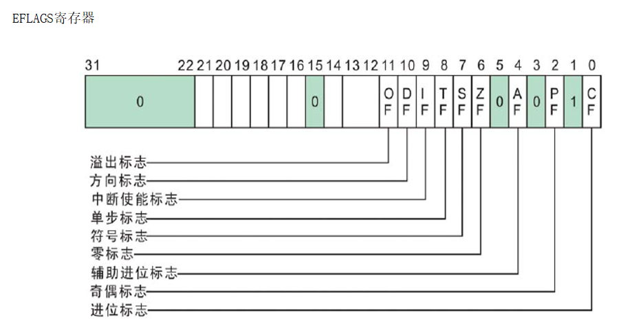

# 标志寄存器：

## 各种标志寄存器

1. 进位标志寄存器(Carry Flag)

   > 如果运算结果的最高位产生了一个进位或借位那么其值为1，否则为0；

2. 奇偶标志寄存器PF(Parity Flag)

   > 奇偶标志PF用于反应运算结果中1的个数的奇偶性。判断依据最低有效字节。
   >
   > 偶数为0，奇数为1

3. 辅助进位标志寄存器AF(Auxiliary Carry Flag)

   > 在发生下列情况下，辅助进位标志AF的值被置为1，否则置为0 。
   >
   > 1、在字操作时，发生低字节向高字节进位或借位时；
   >
   > 2、 在字节操作时，发生低4位向高四位进位或借位时。

4. 零标志寄存器ZF(Zero Flag)

   > 零标志ZF用来反映运算结果是否为0，如果运算结果为0，则其值为1，否则其值为0，在判断运算结果是否为0，可使用此标志位。

5. 符号标志寄存器SF(Sign Flag)

   > 符号标志SF用来反映运算结果的符号位，它与运算结果的最高位相同

6. 溢出标志寄存器OF(Overflow Flag)

   > 溢出标志OF用来反映有符号数加减运算所得结果是否溢出
   >
   > 如果运算结果超过当前运算位所能表示的范围，则称为溢出，OF的值被置为1，否则OF的值被清0。
   >
   > **有符号数：**
   >
   > * 正 + 正 = 正，如果结果为负，则表示有溢出。
   > * 负 + 负 = 负，如果结果为正，则表示有溢出
   > * 正 + 负 = ？，永远不会溢出，考虑极限状况，发现永远不会溢出。
   >
   > **有符号数：**
   >
   > * 只关注运算有没有超过最大值，如果超过了则溢出了。

> 注意区分**辅助进位**和**进位**的**区别**

### 寄存器清零

> eax寄存器清零的两种不同的方法
>
> `xor eax,eax`：标志寄存器会发生变化
>
> `mov eax,0`：标志寄存器不会发生变化

### 最高进位与溢出的区别

> 溢出会越红线（最大值），进位会在红线上，但不会越出去。