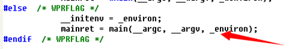

# 函数的入口地址

## main 函数被调用前要先调用的函数如下：

> `GetVersion()`
> `_heap_init()`
> `GetCommandLineA()`
> `_crtGetEnvironmentStringsA()`
> `_setargv()`
> `_setenvp()`
> `_cinit()`

> 因此我们一般程序写的`main`函数并不是程序第一个执行的函数，且程序运行的入口函数是可以修改。`main`函数的参数是不定长参数，且还有一个环境变量需要传进去，所以`main`函数的参数为三个。如图所示：

