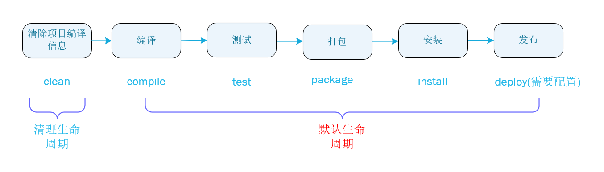

# day09

## JSON

> `JSON`(`JavaScript Object Notaton`)，`JavaScript`对象表示法，`JSON`现在多用于存储和交换文本信息的语法，类似`XML`。`JSON`比`XML`更小、更快、更易于解析。

## JSON语法规则

> 1. 数据在名称/值对中：`json`数据是由键值对构成的；
>    - **键**：用引号(单双都可以)引起来，也可以不使用引号。
>    - **值**的取值类型：
>      - 数字(整数或者字符串)；
>      - 字符串(在双引号中)；
>      - 逻辑值(`true`或`false`)；
>      - 数组(在方括号中)，例：`{"person":[{}, {}]}`；
>      - 对象(在花括号中)，例：`{"address" {"province":"陕西", .. ..}}`；
>      - `null`。
> 2. 数据由逗号分隔：多个键值对由逗号分隔；
> 3. 花括号保存对象：使用`{}`定义`json`格式；
> 4. 方括号保存数组：`[]`。

## 获取JSON数据

> 1. `json对象.键名`；
> 2. `json对象["键名"]`;
> 3. `数组对象[索引]`。

## JSON数据和Java对象的相互转化.

> 使用`JSON`解析器，常见解析器：`Jsonlib`、`Gson`、`fastjson`、`jackson`。

### JSON转Java对象

> `json`对象转`Java`使用步骤：
>
> 1. 导入`jackson`的相关`jar`包；
> 2. 创建`jackson`的核心对象`ObjectMapper`；
> 3. 调用`ObjectMapper`的相关方法进行转化；
>    - `readValue(json字符串, Class)`

### Java对象转JSON

> `Java`对象转`json`使用步骤：
>
> 1. 导入`jackson`的相关`jar`包；
>
> 2. 创建`jackson`的核心对象`ObjectMapper`；
>
> 3. 调用`ObjectMapper`的相关方法进行转化；
>
>    - `writeValue(参数1, obj)`；
>      - `参数1`：
>        - `File`：将`obj`对象转化为`JSON`字符串，并保存到执行的文件中；
>        - `Writer`：将`obj`对象转化为`JSON`字符串，并将`JSON`数据填充到字节输出流中；
>        - `OutputStream`：将`obj`对象转化为`JSON`字符串，并将`JSON`数据填充到字节输出流中。
>    - `writeValueAsString()`：将对象转化为`JSON`字符串；
>    - `writeValueAsBytes()`
>
> **JSON注解**：
>
>    - `@JsonIgnore`：排除属性，给成员变量、`Getter`和`Setter`上任意一个上加即可；
>    - `@JsonFormat`：属性值的格式化。
>
> 复杂数据类型转化：
>
> * `List`：数组；
> * `Map`：与对象格式一致。

### 测试代码

```java
package com_01.jianmo.test;

import com.fasterxml.jackson.core.JsonProcessingException;
import com.fasterxml.jackson.databind.ObjectMapper;
import com_01.jianmo.domain.Person;
import org.junit.Test;

import java.io.IOException;
import java.lang.reflect.Array;
import java.util.*;

public class JacksonTest {
	@Test
	public void Object2JSON() throws JsonProcessingException {
		// 1.创建Person对象
		final Person person = new Person("张三", 21, false, new Date());
		// 2. 创建ObjectMapper对象
		ObjectMapper objectMapper = new ObjectMapper();
		// 3.Object2JSON
		final String s = objectMapper.writeValueAsString(person);
		// 4.打印json字符串
		System.out.println(s);
		/*
		* {"name":"张三","age":21,"gender":false}  // 使用@JsonIgnore
		* 或
		* {"name":"张三","age":21,"gender":false,"birthday":"2020-02-29"}  // 使用@JsonFormat(pattern = "yyyy-MM-dd")
		* */

	}

	@Test
	public void Object2JSONList() throws JsonProcessingException {
		// 1.创建Person对象
		final Person p1 = new Person("张三", 21, false, new Date());
		final Person p2 = new Person("张三", 21, false, new Date());
		final Person p3 = new Person("张三", 21, false, new Date());
		List<Person> person = new ArrayList<>();
		person.add(p1);
		person.add(p2);
		person.add(p3);
		// 2. 创建ObjectMapper对象
		ObjectMapper objectMapper = new ObjectMapper();
		// 3.Object2JSON
		final String s = objectMapper.writeValueAsString(person);
		// 4.打印json字符串
		System.out.println(s);
	}

	@Test
	public void Object2JSONMap() throws JsonProcessingException {
		// 1.创建Person对象
		final Person p1 = new Person("张三", 21, false, new Date());
		final Person p2 = new Person("张三", 21, false, new Date());
		final Person p3 = new Person("张三", 21, false, new Date());
		Map<String, Person> person = new HashMap<>();
		person.put("张三1", p1);
		person.put("张三2", p2);
		person.put("张三3", p3);
		// 2. 创建ObjectMapper对象
		ObjectMapper objectMapper = new ObjectMapper();
		// 3.Object2JSON
		final String s = objectMapper.writeValueAsString(person);
		// 4.打印json字符串
		System.out.println(s);
	}

	@Test
	public void JSON2Object() throws IOException {
		// 1.创建json字符串
		final String s = "{\"name\":\"张三\",\"age\":21,\"gender\":false}";
		// 2. 创建ObjectMapper对象
		ObjectMapper objectMapper = new ObjectMapper();
		// 3.JSON2Object
		final Object obj = objectMapper.readValue(s, Person.class);
		// 4.打印Person对象
		System.out.println(obj); // Person{name='张三', age=21, gender=false}
	}
}
```

### Person类

```java
package com_01.jianmo.domain;


import com.fasterxml.jackson.annotation.JsonFormat;
import com.fasterxml.jackson.annotation.JsonIgnore;

import java.util.Date;


public class Person {
	private String name;
	private Integer age;
	private boolean gender;

	// @JsonIgnore  // 忽略该属性
	@JsonFormat(pattern = "yyyy-MM-dd")  // 年月日
	private Date birthday;

	public Person() {
	}

	public Person(String name, Integer age, boolean gender, Date birthday) {
		this.name = name;
		this.age = age;
		this.gender = gender;
		this.birthday = birthday;
	}

	public String getName() {
		return name;
	}

	public void setName(String name) {
		this.name = name;
	}

	public Integer getAge() {
		return age;
	}

	public void setAge(Integer age) {
		this.age = age;
	}

	public boolean isGender() {
		return gender;
	}

	public void setGender(boolean gender) {
		this.gender = gender;
	}

	public Date getBirthday() {
		return birthday;
	}

	public void setBirthday(Date birthday) {
		this.birthday = birthday;
	}

	@Override
	public String toString() {
		return "Person{" +
				"name='" + name + '\'' +
				", age=" + age +
				", gender=" + gender +
				", birthday=" + birthday +
				'}';
	}
}
```

## Redis

> `redis`是一个款高性能的`NOSQL`系列的非关系型数据库，`redis`做缓存。`Redis`缓存一些**不经常发生变化的数据**，数据库的数据一旦发生**增删改**，则需要更新缓存，需要将`redis`缓存数据情况，再次存入。
>
> 1. 数据之间没有关联关系；
> 2. 数据存储在内存中。

### Redis简介

> `Redis`使用C语言开发的一个开源的高性能键值对(`key-value`)数据库，目前为止`Redis`支持的键值数据类型如下：
>
> - 键值数据类型：
>   1. 字符串类型`string`；
>   2. 哈希类型`hash`；
>   3. 列表类型`list`；
>   4. 集合类型`set`；
>   5. 有序集合类型`sortedset`。
> - `redis`的应用场景：
>   - 缓存：数据查询、短连接、新闻内容、商品内容等等；
>   - 聊天室在线好友列表；
>   - 任务队列：秒杀、抢购、12306等等；
>   - 应用排行榜；
>   - 网站访问统计；
>   - 数据过期处理，可以精确到毫秒；
>   - 分布式集群架构中的`session`分离。

## Redis数据结构

> `redis`存储的是：`key-value`格式的数据，其中`key`都是字符串，`value`有5种不同的数据结构。
>
> - `value`键值数据类型：
>   1. 字符串类型`string` : `string`；
>   2. 哈希类型`hash` : `map`；
>   3. 列表类型`list` : `linkedlist`；
>   4. 集合类型`set` : `hashset`；
>   5. 有序集合类型`sortedset` : 可以排序的`hashset`。

### 字符串类型

> 1. 存储：`set key value`
> 2. 获取：`get key`
> 3. 删除：`del key`

### 哈希类型

> 1. 存储：`hset key field value`
> 2. 获取指定的`field`：`hget key field`
> 3. 获取所有的键和值：`hgetall key`
> 4. 删除：`hdel key field`

### 列表类型

> `Redis`列表是一个简单的字符串列表，按照插入顺序排序。你可以添加一个元素到列表的头部(左边`lpush`)或尾部(右边`rpush`)。一个列表可以包含`2^32 - 1`个元素，每个列表超过40亿个元素。
>
> 1. 将元素加入到列表左边：`lpush key value`
> 2. 将元素加入到列表右边：`rpush key value`
> 3. 从左到右获取范围的元素：`lrange key start end`，获取所有使用`lrange key 0 -1`
> 4. 从列表最左边弹出一个元素：`lpop`
> 5. 从列表最右边弹出一个元素：`rpop`

### 集合类型

> 1. 存储数据：`sadd key value`
> 2. 获取`set`集合中所有元素：`smembers key`
> 3. 删除`set`集合中的某个元素：`srem key value`

### 有序集合类型

> 1. 存储数据：`zadd key score value`
> 2. 获取数据和分数：`zrange key start end [withscores]`
> 3. 删除数据：`zren key value`

### 通用命令

> 1. 查询所有的键：`keys *`
> 2. 获取`key`对应的`value`类型：`type key`
> 3. 删除指定的`key-value`：`del key`

## Redis持久化

> `Redis`是一个内存数据库，当`Redis`服务器重启后或电脑重启户，数据会丢失，我们可以将`Redis`内存中的数据持久化保存到电脑硬盘中。

### RDB

> `RDB`(`Redis DataBase`)默认方式，不需要进行配置。在一定的间隔时间中，检测`key`的变化情况，然后持久化数据。
>
> 1. 编辑`/etc/redis.conf`配置文件进行持久化配置；
>
>    ```shell
>    save 900 1  # after 900 sec (15 min) if at least 1 key changed
>    save 300 10  # after 300 sec (5 min) if at least 10 keys changed
>    save 60 10000  # after 60 sec if at least 10000 keys changed
>    ```
>
> 2. 重新启动`redis`服务器，并指定配置文件名称`redis-server /etc/redis.conf`；

### AOF

> `AOF`(`Append Only File`)日志记录的方式，可以记录每一条命令的操作，可以每一次命令操作后，持久化数据。
>
> 编辑`/etc/redis.conf`配置文件配置，默认为`appendonly no`关闭`AOF`，需要改为`yes`，开启`AOF`持久化机制。
>
> ```shell
> # appendfsync always  # 每一次操作都进行持久化
> appendfsync everysec  # 每一秒进行一次持久化
> # appendfsync no  # 不进行持久化
> ```

## Java客户端Jedis

> 一款`java`操作`redis`数据库的工具。
>
> 使用步骤：
>
> 1. 下载`jedis`的`jar`包；
> 2. 获取链接；
> 3. 操作`redis`数据库；
> 4. 关闭连接
>
> ```java
> package com_02.jianmo.Jedis.test;
> 
> import org.junit.Test;
> import redis.clients.jedis.Jedis;
> 
> public class JedisTest {
> 	@Test
> 	public void test01() {
> 		// 1.获取链接
> 		final Jedis jedis = new Jedis("192.168.91.103", 6379);
> 
> 		// 2. 操作redis数据库
> 		final String set = jedis.set("username", "pip");
> 		System.out.println(set);
> 
> 		// 3.关闭连接
> 		jedis.close();
> 	}
> 
> }
> ```

## Jedis操作Redis

> `Jedis`操作`Redis`的方式和`Redis`的命令一样。

### 字符串类型

> 1. `set`
> 2. `get`

### 哈希类型

> 1. `hset`
> 2. `hget`
> 3. `hgetAll`

### 列表类型

> 1. `lpush/rpush`
> 2. `lpop/rpop`

### 集合类型

> 1. `sadd`

### 有序集合类型

> 1. `zadd`

```java
package com_02.jianmo.Jedis.test;

import org.junit.After;
import org.junit.Before;
import org.junit.Test;
import redis.clients.jedis.Jedis;

import java.util.Map;
import java.util.Objects;

public class JedisTest {
	Jedis jedis = null;

	@Before
	public void init() {
		// 获取链接
		this.jedis = new Jedis("192.168.91.103", 6379);
	}

	@After
	public void destroy() {
		// 关闭连接
		jedis.close();
	}

	@Test
	public void test01() {
		// 2. 操作redis数据库
		final String set = jedis.set("username", "pip");
		System.out.println(set);


	}

	/**
	 * String操作
	 */
	@Test
	public void testString() {
		this.jedis.set("password", "123456");
		final String password = this.jedis.get("password");

		// 指定key过期时间为20s，过期后自动删除
		this.jedis.setex("activeCode", 20, "abcd");

		System.out.println(password);
	}

	/**
	 * Hash操作
	 */
	@Test
	public void testHash() {
		this.jedis.hset("person", "name", "zhangsan");
		this.jedis.hset("person", "age", "18");
		final String value = this.jedis.hget("person", "name");
		System.out.println(value);
		System.out.println("=============");
		final Map<String, String> person = jedis.hgetAll("person");
		System.out.println(person);
	}

	/**
	 * List操作
	 */
	@Test
	public void testList() {
		this.jedis.lpush("list", "1");
		this.jedis.lpush("list", "2");
		this.jedis.rpush("list", "3");
		this.jedis.rpush("list", "4");

		System.out.println(this.jedis.lrange("list", 0, -1));
		System.out.println(this.jedis.lpop("list"));
		System.out.println(this.jedis.rpop("list"));
	}

	/**
	 * Set集合操作
	 */
	@Test
	public void testSet() {
		this.jedis.sadd("set", "a", "d", "c", "e");
		System.out.println(this.jedis.smembers("set"));
	}

	/**
	 * SortedSet操作
	 */
	@Test
	public void testSortedSet() {
		this.jedis.zadd("sorted", 10, "a");
		this.jedis.zadd("sorted", 8, "b");
		this.jedis.zadd("sorted", 11, "c");
		System.out.println(this.jedis.zrange("sorted", 0, -1));
	}

}
```

## Jedis连接池

> 1. 创建`JedisPool`连接池对象；
> 2. 调用方法`getResource()`获取`Jedis`连接；
> 3. 进行操作`Redis`；
> 4. 归还连接。
>
> ```java
> package com_03.jianmo.JedisPool;
> 
> import org.junit.Test;
> import redis.clients.jedis.Jedis;
> import redis.clients.jedis.JedisPool;
> import redis.clients.jedis.JedisPoolConfig;
> 
> public class JedisPoolTest {
> 	@Test
> 	public void JedisPoolTest() {
> 		// 0.创建一个配置对象
> 		final JedisPoolConfig jedisPoolConfig = new JedisPoolConfig();
> 		jedisPoolConfig.setMaxTotal(50);  // 最大活动对象
> 		jedisPoolConfig.setMaxIdle(10);  // 最大能够保持idel状态的对象数
> 
> 		// 1.创建Jedis连接池对象
> 		final JedisPool jedisPool = new JedisPool(jedisPoolConfig, "192.168.91.103", 6379);
> 		
> 		// 2.获取连接
> 		final Jedis resource = jedisPool.getResource();
> 
> 		// 4.使用连接操作
> 		resource.set("resource", "pool");
> 		System.out.println(resource.get("resource"));
> 
> 		// 5.归还到连接池中
> 		resource.close();
> 	}
> }
> ```

## Jedis详细配置

```shell
# 最大活动对象数     
redis.pool.maxTotal=1000    
# 最大能够保持idel状态的对象数      
redis.pool.maxIdle=100  
# 最小能够保持idel状态的对象数   
redis.pool.minIdle=50    
# 当池内没有返回对象时，最大等待时间    
redis.pool.maxWaitMillis=10000    
# 当调用borrow Object方法时，是否进行有效性检查    
redis.pool.testOnBorrow=true    
# 当调用return Object方法时，是否进行有效性检查    
redis.pool.testOnReturn=true  
# “空闲链接”检测线程，检测的周期，毫秒数。如果为负值，表示不运行“检测线程”。默认为-1.  
redis.pool.timeBetweenEvictionRunsMillis=30000  
# 向调用者输出“链接”对象时，是否检测它的空闲超时；  
redis.pool.testWhileIdle=true  
# 对于“空闲链接”检测线程而言，每次检测的链接资源的个数。默认为3.  
redis.pool.numTestsPerEvictionRun=50  
# redis服务器的IP    
redis.ip=xxxxxx  
# redis服务器的Port    
redis1.port=6379   
```

## Maven简介

> `Maven`是一个项目逇管理工具，它包含了一个对象对象模型(`POM：Project Object Model`)，一组标准集合，一个项目声明周期(`Project Lifecycle`)，一个依赖管理系统(`Dependency Management System`)，和用来定义在生命周期阶段(`phase`)中插件(`plugin`)目标的逻辑。即`Maven`的主要功能：构建项目、管理`jar`包、编译代码、自动运行单元测试、打包、生成报表、部署项目和生成`Web`站点。

### Maven依赖管理

> 依赖管理就是`Maven`对于`Java`项目的`jar`包的管理。`Maven`管理的项目中的`jar`包在`jar`包仓库而不是`Java`项目中，`Java`项目运行会通过`jar`包的坐标来定位到`jar`包仓库中对应的`jar`包，通过`pom.xml`管理`jar`包。

### 项目一键构建

> 项目一般需要经过编译、测试、运行、打包、安装、部署等过程，一键构建则将这些过程交给`maven`进行管理。

### Maven安装

> 1. 下载`Maven`的`zip`包，并解压到一个不包含中文名的路径中；
> 2. 配置环境变量：`MAVEN_HOME=E:\apache-maven-3.6.3`；
> 3. 配置`Path`：`%MAVEN_HOME%\bin`。

### Maven仓库的种类和彼此关系

> `Maven`的`conf/settings.xml`文件中`localRepository`标签配置`jar`包的仓库，默认路径为`${user.home}/.m2/repository`。
>
> `Maven`仓库的分类：
>
> 1. 本地仓库；
> 2. 远程仓库(私服)；
> 3. 中央仓库。

## Maven标准目录结构

> `Maven`项目目录结构：
>
> * `/`：项目根目录
>   * `src/`
>     * `main/`
>       * `java/`：该目录放置**核心代码**；
>       * `resources/`：该目录放置**核心配置文件**；
>       * `webapp/`：`web`的页面资源，`js`、`css`、图片等等。
>     * `test/`
>       * `java/`：该目录放置**测试代码**；
>       * `resources/`：该目录放置**测试配置文件**；

## Maven常用命令

> 参考链接：https://www.jianshu.com/p/6f57c322e50e
>
> 1. `mvn clean`：清除编译的文件；
> 2. `mvn compile`：执行编译操作；
> 3. `mvn test`：执行编译`main`和`test`目录的代码，并执行测试代码；
> 4. `mvn package`：根据配置文件对项目打包；
> 5. `mvn install`：安装项目文件，把项目的`jar`包安装到本地仓库。

## Maven生命周期



## Maven配置文件

> `pom.xml`配置文件包含信息：
>
> 1. 项目自身信息；
> 2. 项目运行所依赖的`jar`包信息；
> 3. 项目运行环境信息，如：`jdk`、`tomcat`信息。
>
> 依赖管理模型的`jar`包至少需要包含的信息：
>
> 1. 公司组织的名称；
> 2. 项目名；
> 3. 版本号；