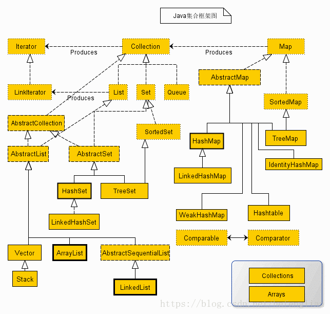

# day05

[TOC]

## Java集合类图

### Java集合框架图

> 图片来源链接：https://blog.csdn.net/hefenglian/article/details/82596453



### Java集合框架体系图

> 图片来源链接：https://blog.csdn.net/hefenglian/article/details/82596453


### Class diagram of Java Collections framework

> 国外小哥整理的，自己也不知对错，都放在这里，等深入学习后再回头来看。
>
> 图片来源：https://www.codejava.net/java-core/collections/overview-of-java-collections-framework-api-uml-diagram
>
> 摘录：
>
> The Java collections framework has a very complex API hierarchy.
> The following class diagram shows a brief overview of the Java Collections Framework which is divided into four groups: List, Set, Map and Queue. Only the principal, commonly-used interfaces and classes are listed.


## 集合

1. 会使用集合存储数据；
2. 会遍历集合，把数据取出来；
3. 掌握每种集合的特性。

* `Collection`接口

  ```
  定义的是所有单列集合中共性的方法，所以的单列集合都可以使用共性的方法
  ```
  * `List`接口

      ```
      1. 有序的集合(存储和取出元素顺序相同)
      2. 允许存储重复的元素
      3. 有索引，可以使用普通的`for循环`遍历
      ```

  	* `Vector`集合
  	* `ArrayList`集合
  	* `LinkedList`集合
  	
  * `Set`接口

      ```
      1.不允许存储重复元素
      2.没有索引(不能使用普通的for循环遍历)
      3.无序的集合(TreeSet/hashSet存储和取出元素的顺序有可能不一致)，LinkedHashSet是一个有序集合。
      ```
  	
  	* `TreeSet`集合
  	* `hashSet`集合
  		* `LinkedHashSet`集合

## 集合框架的学习方法

```
1. 学习顶层：是学习顶层接口/抽象类中共性的方法，所有的子类都可以使用；
2. 使用底层：底层不是接口就是抽象类，无法创建对象使用，需要使用底层的子类创建对象使用。
```

## Collection

> `Collection`是单列集合类的根接口，有两个重要的子接口：`java.util.List`和`java.util.Set`

* `Collection`
  * `java.util.List`
    * `java.util.ArrayList`
    * `java.util.LinkedList`
  * `java.util.Set`
    * `java.util.HashSet`
      * `java.util.LinkedHashSet`
    * `java.util.TreeSet`

### Collection常用功能

* `public boolean add(E e)`：给定元素的对象添加到当前的集合中；
* `public void clear()`：清空集合中所有的元素；
* `public boolean remove(E e)`：把给定的对象在当前集合中删除；
* `public boolean contains(E e)`：判断当前集合中是否包含给定的对象；
* `public boolean isEmpty()`：判断当前集合是否为空；
* `public int size()`：返回集合中元素的个数；
* `public Object[] toArray()`：把集合中的元素，存储到数组中。

## Iterator迭代器

### Iterator接口

> 在程序的开发中，需要经常遍历集合中的所有元素。所以JDK提供了一个接口`java.util.Iterator`，`Iterator`接口也是`java`集合中的一成员，但它与`Collection`、`Map`接口不同。`Collection`接口与`Map`接口主要用于存储元素，而`Iterator`主要用于迭代访问`Collection`中的元素，所以`Iterator`对象也被成为迭代器。
>
> `Iterator`是一个接口，所以无法实例化，需要通过`Collection`接口的方法`public Iterator iterator()`，返回一个迭代器的实现类对象。

* `public Iterator iterator()`：获取对应集合的迭代器，用来遍历集合中的元素。

### 迭代

> `Collection`集合元素的通用获取方式，在取元素之前先要判断集合中有没有元素，如果有，就把这个元素取出来，继续判断，如果还有元素则继续拿出来元素。直到把集合中的所有元素都取出来，这种方式成为迭代。

* `public E next();`：返回迭代器的下一个元素；
* `public boolean hasNext();`：判断是否有下一个元素。

### 迭代器使用步骤

1. 使用集合中的方法`iterator()`获取迭代器的实现类对象，使用`Iterator`接口接收(多态)；
2. 使用`Iterator`接口中的方法`hasNext()`判断是否有下一个元素；
3. 使用`Iterator`接口中的方法`next()`取出集合的下一个元素，元素作为返回值返回。

```java
package com_02.jianmo.Iterator;

import java.util.ArrayList;
import java.util.Collection;
import java.util.Iterator;

public class IteratorTest {
	public static void main(String[] args) {
		Collection<String> coll = new ArrayList<>();

		coll.add("李四"); coll.add("王五");
		coll.add("赵六"); coll.add("田七");

		Iterator<String> it = coll.iterator();  // 1.第一步，获取迭代器
		while (it.hasNext()) {  // 2.第二步，判断是否有下一个值
			System.out.println(it.next());  // 3.第三步，获取元素
		}
	}
}
```

### 迭代器实现原理

> `public Iterator iterator()`：方法返回的是指向`-1`位置的**指针**。
>
> `public E next();`：1、取出下一个元素，2、指针后移。如有没有元素则会抛出异常`NoSuchElementException`。
>
> `public boolean hasNext();`：判断是否有下一个元素。

## 增强for循环

> `JDK 1.5`之后出现的，专门用来遍历数组和集合的。内部实现是一个迭代器。

```java
for(元素的数据类型 变量:Collection集合或者数组) {
    // 变量
}
```

### 示例代码

```java
package com_02.jianmo.Iterator;

import java.util.ArrayList;
import java.util.Collection;
import java.util.Iterator;

public class IteratorTest {
	public static void main(String[] args) {
		Collection<String> coll = new ArrayList<>();

		coll.add("李四"); coll.add("王五");
		coll.add("赵六"); coll.add("田七");

		for (String i:coll) {
			System.out.println(i);
		}
	}
}
```

