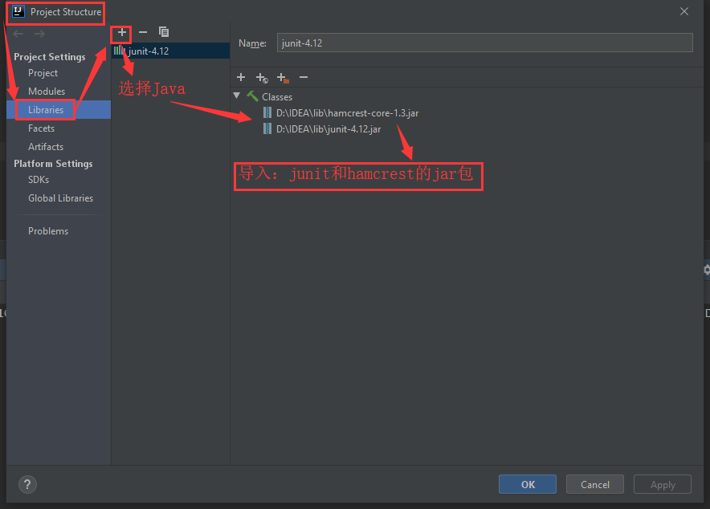

# day13

## Junit单元测试

> `Junit`就是属于白盒测试。

### 测试分类

* **黑盒测试**：不需要写代码，给输入值，看程序是否能够输出期望的值；
* **白盒测试**：需要写代码的，关注程序具体的执行流程。

### Junit使用

1. 定义一个测试类；
   * 类名：建议测试类的类名为`测试的类名Test`，例如：`CalculatorTest`；
   * 包名：`xxx.yyy.zzz.test`包。
2. 定义测试方法：测试方法可以独立运行；
   * 方法名：`test测试的方法名`，例如：`testAdd()`；
   * 返回值：`void`类型，因为测试方法需要独立运行，所以返回值建议为`void`类型；
   * 参数列表：因为测试方法需要独立运行，所以建议空参。
3. 给方法加`@Test`注解；
4. 导入`Junit`依赖，测试方法可以运行；

### Junit结果判定

> 测试程序一般不输出结果，使用断言进行判断。
>
> * 红色：失败；
> * 绿色：成功；
> * 一般会使用断言操作来处理结果`public static void assertEquals(long expected, long actual);`还有其他的方法进行断言判断。
>   * 第一个参数`expected`：期望的结果；
>   * 第二个参数`actual`：实际的结果。

### Junit注解

* `@Before`：初始化方法，用于资源的申请，所有**测试方法**在执行**之前**都会执行该方法。自动在执行每个测试方法之前调用执行；
* `@After`：用于资源的释放，所有**测试方法**在执行**之后**都会执行该方法。自动执行，即使前面的程序出错也会执行。

## Junit运行问题解决

> 参考链接：https://blog.csdn.net/Feihongxiansen/article/details/83245832

## 反射

## 注解