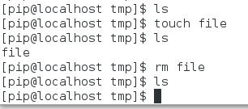
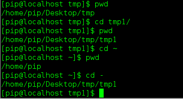
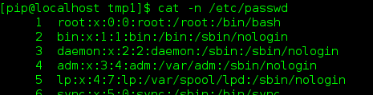
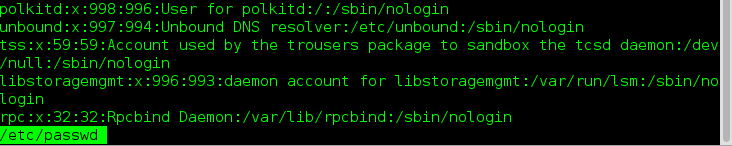
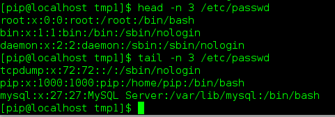
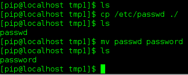
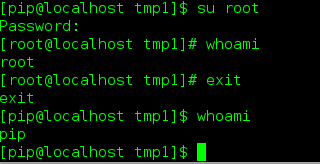
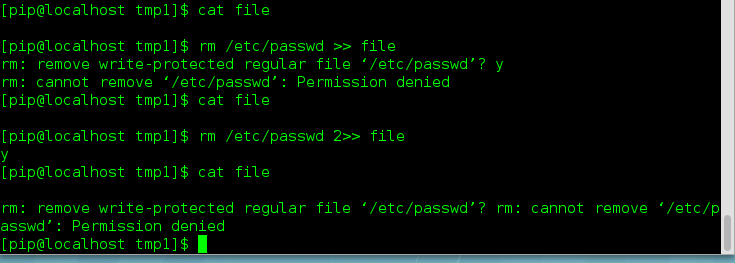

# Linux基础知识(1)

## 添加系统语言设置

>    `Application`   ---> `System Tools` --->  `Settings` ---> `Region & Language`
>
>    点击`加号`选择添加的输入法，找到中文输入法后，选择点击右上角的添加即可。

## 进入虚拟控制台

>   `Ctrl + Alt + F1/F7`进入图形界面
>
>   `Ctrl + Alt + F2 ~ F6`进入图形界面
>
>   通过`man  init `可以查看系统运行的等级。

## 命令补齐Tab

>   `linux`的神兵利器，不仅可以提高打印命令的效率，还可以提高命令的正确率。
>
>   按一下`Tab`，如果补齐结果唯一那么直接补齐，如果不唯一则需要按两下显示所有的可能结果。

## linux虚拟机

>   对vmware虚拟机操作的命令，通过`rht-vmctl --help`获取帮助信息
>
>   *     `view`  ：launches console viewer of VMNAME
>   *     `start`：obtain and start up VMNAME
>   *     `stop` ：stop a running VMNAME
>   *     `poweroff`：if running, force stop VMNAME
>   *     `reset`： poweroff, return to saved or original state, start VMNAME
>   *     `save`： stop, save image, start VMNAME (to DATETIME)
>   *     `restore`：poweroff, restore to save (to DATETIME), start VMNAME
>   *     `listsaves`：list the saves of VMNAME
>   *     `status` ：display libvirt status of VMNAME
>   *     `get`：if not here, obtain VMNAME from server
>   *     `remove`：remove VMNAME from system
>   *     `fullreset`：poweroff, reobtain from server, start VMNAME (bad save/image)

## linux命令控制

*   `mkdir`：创建一个空目录
    *   `-p`：递归创建目录

*   `rmdir`：移除一个空目录
    *   `-p`：递归移除一个目录

        

*   `rm`：移除一个文件
    *   `-r`：递归移除
    *   `-f`：强制移除
    *   `-d`：移除一个目录

*   `touch`：改变一个文件的时间戳，但是常常用来创建一个文本文件

    *   `touch file`：创建一个文件

        

*   `cd` ：`change directory`改变工作路径
    *   `~`：进入当前用户的家目录
    *   `..`：进入当前目录的上一级目录
    *   `-`：进入上一个工作目录

*   `pwd`：`print work directory`打印当前工作路径

    

*   `ls`：`list`查看当前目录下的文件内容
    *   `-a`：列出所有内容，包含隐藏文件，`linux` 的隐藏文件是以`.`开始的
    *   `-l`：长格式查看文件详细信息
    *   `-d`：查看目录的信息
    *   `-S`：按照文件大小排序打印
    *   `-h`：按照人类习惯的方式显示文件的大小

*   `cat`：查看文件的内容

    

*   `less` ：分页浏览文件的内容

    >   按`q`退出，`空格`下一屏，`b`上一屏

    

*   `head`：查看文件内容的前几行
    *   `-n`：指定打印的行数，如果不指定那么就默认打印`10`行
        *   `head -n 20`：查看文件的前20行

*   `tail` ：查看文件内容的后几行
    *   `-n`：制订打印的行数，与`head`对应

    *   `-f`：实时监控文件的内容

        

*   `wc`：统计文件字符数
    *   `-l`：`lines`统计行数

    *   `-w`：`world`单词数

    *   `-c`：`bytes`字节数目

    *   `-m`：`chars`字符数，中文汉字的时候和上一个参数就有不同的结果了

        

*   `cp`：拷贝文件
    *   `cp 目标文件 副本文件`

*   `mv`：移动文件
    *   `mv 源地址文件名 目标路径`，将文件从源地址移动到目标地址

    *   `mv 源地址文件名 目标路径名和文件名  `，移动文件并重新命名为新的文件名

    *   `mv 源文件文件名 新文件名`，对文件进行重新命名

        

*   `whatis`：查看某一个命令的功能
    *   `whatis ls`：查看`ls`命令的功能

*   `history`：查看系统的历史命令
    *   `-c`：清空当前`shell`的命令历史，不会真正清除，打开其他终端仍然可以查看到。

    *   `!num`：感叹号加数字，调用命令历史中的第`num`个命令

    *   `!string`：感叹号加字符串，调用命令历史中最近一次以这些字符开头的命令。

    *   `模糊查找`：命令终端输入一字符串，然后`Ctrl + r`，查找包含这个字符串的命令。

        

*   `su`：`switch user`切换用户

    -   `su - 用户名`：切换到某用户

*   `exit` ：退出当前用户

*   `whoami`：查看当前用户

    

*   `file`：查看文件类型
    *   `file filename`：查看文件类型

*   `find`：查找文件
    *   `find /etc/ -name passwd`：在`/etc/`目录下查找名字为`passwd`的文件

*   `who`：查看当前在线用户

    

## linux通配符

>   *   不存在的文件使用`{}`
>   *   存在的文件使用`[]`
>   *   `*`：匹配任意字符，匹配任意次
>   *   `?`：匹配任意字符，匹配一次
>   *   `[[:alpha:]]`：匹配单个大小写字母
>   *   `[[:lower:]]`：匹配单个小写字母
>   *   `[[:upper:]]`：匹配单个大写字母
>   *   `[[:digit:]]`：匹配单个数字
>   *   `[[:alnum:]]`：匹配单个数字或字母
>   *   `[1-9]`：匹配1到9的任意数字
>   *   `^`/`!`：表示不匹配括号内的任何一个字符
>       *   `[^123]`：不匹配1、2、3字符

## 中断程序

>   如果一个程序正在运行使用`Ctrl + c`中断一个程序的运行

## 获取命令的帮助信息

>   `linux`中有很多的命令，如果需要获取一个命令的帮助信息可以通过以下命令
>
>   *   `man cmd`：通过`man`手册查询命令的用法
>       *   `[]`：表示可选参数
>       *   `...`：选项加入的个数可以加多个
>       *   `<>`：选项是必须要加的
>       *   `man num cmd`：在`man`手册的第`num`个手册查看`cmd`命令
>   *   `whatis cmd`：查看命令的功能
>   *   `cmd --help` ：查看命令的基本用法
>       *   `Usage`：标出命令用法

## vim编辑器

>   [转载链接](https://www.cnblogs.com/yangjig/p/6014198.html)，点击查看所有的`vim`的命令和快捷键，`vim`是`linux`上一个十分强大的编辑器，用过的都知道。嘻嘻嘻嘻。。。

## linux快捷键

>   *   `方向键左右`：一个字符一个字符移动
>
>   *   ` Ctrl + 左右 ` ：一个字一个字移动
>   *   ` Ctrl + a ` ：光标移动到行首
>   *   ` Ctrl + e ` ：光标移动到行尾
>   *   ` Ctrl + u `  ：光标所在位置删除到行首
>   *   ` Ctrl + k `  ：光标所在位置删除到行尾
>   *   ` Ctrl + r + 关键字 `：调出最近一条含有关键字的命令
>   *   ` Ctrl + c `  ：撤销以输入的命令
>   *   ` Ctrl + d `   ：关闭当前环境
>   *   ` Ctrl + L `  ：清空屏幕
>   *   ` Ctrl + shift + c ` ：复制
>   *   ` Ctrl + shift + v `  ：粘贴
>   *   ` Ctrl + shift + t  ` ：在现有shell中重新打开一个`table `
>   *   ` Ctrl + shift + n `  ：在shell中打开一个新的`shell`
>   *   ` Ctrl + shift + pageup|pagedown  `：切换`table`
>   *   ` Ctrl + alt + l `   ： 锁屏

## linux目录结构

>   *   一级目录：
>       *   `/`：根目录
>   *   二级目录：
>       *   `/bin`：二进制可执行文件也就是系统命令
>       *   `/sbin`：系统管理命令存放位置
>       *   `/boot`：启动分区，负责系统启动
>       *   `/dev`：设备管理文件
>       *   `/etc`：大多数系统管理文件markdownpad插入本机图片
>       *   `/home`：普通用户的家目录
>       *   `/lib`：32位系统库文件存放位置
>       *   `/lib64`：64位系统库文件存放位置
>       *   `/media`：系统临时设备挂载点                                  
>       *   `/mnt`：系统临时设备挂载点
>       *   `/run`：系统临时设备挂载点
>       *   `/opt`：第三方软件安装位置
>       *   `/proc`：系统信息
>       *   `/root`：超级用户家目录
>       *   `/srv，/var`：系统数据
>       *   `/sys`：系统管理，主要是关于内核的
>       *   `/tmp`：系统临时文件存放位置
>       *   `/usr`：系统用户相关信息数据及用户自定义软件存放位置

## 系统输入输出

>   *   输出重定向`>`
>
>       使用`>`，`标准输入(0)`、`标准输出(1)`、`标准错误(2)`
>
>       标准输入：程序的输入
>
>       标准输出：程序正确的输出
>
>       标准错误：程序错误的输出
>
>       *   `1>` / `>`：对标准输出进行重定向输出
>       *   `2>`：对标准错误进行重定向输出
>       *   `&>`：标准输出和标准错误都进行重定向输出
>       *   `>>`：在输出文件的末尾进行追加输出
>       *   `>`：在输出文件的内容先清空再输出
>
>       
>
>       
>
>   *   管道`|`，把前一条命令的输出变成后一条命令的输入
>
>       *   `cmd_1 | cmd_2`将`cmd_1`的命令输出作为`cmd_2`的输入，管道只允许正确输入
>
>           > `find /etc/ -name passwd 2>&1  | wc -l`将错误的信息重定向到正确的输出中，所有信息就可以通过管道了。
>
>       *   `tee`：保存输出到文件中
>
>           >   `find /etc/ -name passwd 2>&1  | tee filename | wc -l`，`tee`保存信息到文件中
>
>   *   输入重定向`<`
>
>       *   `cat > filename << EOF`，当输入EOF的时候结束输入，中间输入的内容全部重定向到了，`filename`文件中

## redhat安装wps

>   网上有很多就不写了随便找个链接放在上面吧。。。。。。
>
>   [下载地址](http://www.wps.cn/product/wpslinux)
>
>   [安装教程地址](https://blog.csdn.net/kzjay/article/details/39271081)，出现问题一般都是依赖问题，自行解决

## redhat使用QQ等win软件

>请自行了解wine，[官网链接地址](https://www.winehq.org/)