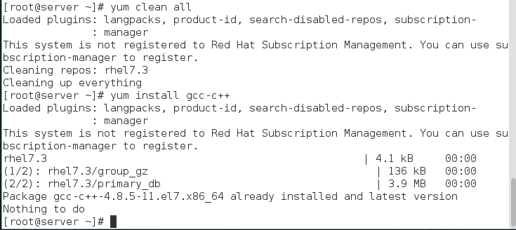
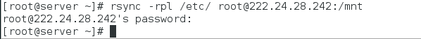
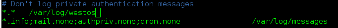
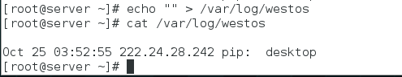
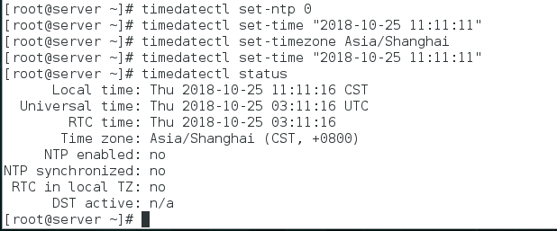
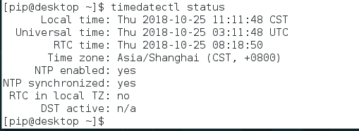
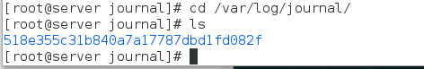

# Linux基础练习题

1.  在server主机中配置yum仓库，并安装gcc编辑器

  >   安装命令`yum install -y gcc-c++`

  

2.  在server主机中把`/etc`目录打包压缩到`/mnt`中，名字为`etc.tar.gz`

  

3.  复制seerver主机中的'etc.tar.gz'到desktop主机的/mnt中

    

4.  同步server主机中的`/etc`中的所有文件到desktop主机`/mnt`中，包含连接文件

    

5.  配置desktop主机和server主机的日至服务要求如下
    1.  desktop主机中的日志全部定向到/var/log/westos文件中

        

    2.  时时同步desktop主机中的所有日志到server中

        

        

6.  在server主机中用timedatectl命令设定时区为上海，时间为11:11:11

    

7.  配置server主机的chronyd服务，使server主机中的时间可以被desktop主机同步

    

8.  同步server主机中的时间到desktop主机中

    

9.  配置系统中的systemd-journal程序，使journal命令可以查看到关机前的日志

    
