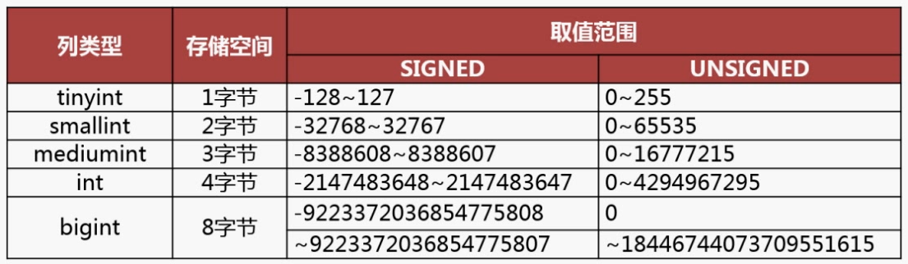

# MySQL

## 数据类型



## 索引

### 索引分类

- 数据结构：B+树索引、Hash索引、Full-text索引；
- 物理存储：聚簇索引（主键索引）、二级索引（辅助索引）；
    - 主键索引B+树存储的是实际数据；
    - 二级索引B+树存储的是主键ID。
- 字段特性：主键索引、唯一索引、普通索引、前缀索引；
- 字段个数：单列索引、联合索引。

### B+树存储优势

1. B+树和B树
    1. B+树只在叶子节点存储数据，且叶子节点通过双向链表连接；
    2. B树非叶子节点也要存储数据。
2. B+树和二叉树
    1. B+树可以有多个子节点，极大地降低树的高度，降低IO次数；
    2. 二叉树只能两个子节点，磁盘IO次数多。
3. B+树和Hash
    1. B+树通过索引在等值查询和范围查询都有不错的性能；
    2. Hash只适合等值查询，无法范围查询。

### 索引创建

#### 主键索引

- 一个表只能有一个主键索引

```sql
CREATE TABLE user(
	id int PRIMARY KEY auto_increment
);
```

#### 唯一索引

- 一个表可以有多个唯一索引，但是每一个唯一索引列值必须是唯一的，允许空值

```sql
CREATE TABLE user(
	phone varchar(11) NOT NULL,
	UNIQUE INDEX idx_ph(phone)
);
```

#### 普通索引

```sql
CREATE TABLE user(
	phone varchar(11) NOT NULL,
	INDEX idx_ph(phone)
);
```

#### 前缀索引

- 前缀索引对字符类型前几个字符建立的索引，可以建立在char、varchar、binary、varbinary上；

```sql
CREATE TABLE user(
	phone varchar(11) NOT NULL,
	INDEX idx_ph(phone(6))
);
```

### 索引原则

#### 是否创建索引

- 需要占用物理空间，数量越大，占用空间越大；
- 创建索引和维护索引要耗费时间，这种时间随着数据量的增加而增大；
- 会降低表的增删改的效率，因为每次增删改索引，B+ 树为了维护索引有序性，都需要进行动态维护。

#### 使用索引

- 字段有唯一性限制的，比如uid；
- 经常用于WHERE查询条件的字段，这样能够提高整个表的查询速度，如果查询条件不是一个字段，可以建立联合索引。
- 经常用于GROUP BY、ORDER BY的字段这样在查询的时候就不需要再去做一次排序了，因为我们都已经知道了建立索引之后在 B+Tree 中的记录都是排序好的。

#### 不使用索引

- WHERE 条件，GROUP BY，ORDER BY 里用不到的字段，索引的价值是快速定位，如果起不到定位的字段通常是不需要创建索引的，因为索引是会占用物理空间的。
- 字段中存在大量重复数据，不需要创建索引，比如性别字段，只有男女，如果数据库表中，男女的记录分布均匀，那么无论搜索哪个值都可能得到一半的数据。在这些情况下，还不如不要索引，因为 MySQL 还有一个查询优化器，查询优化器发现某个值出现在表的数据行中的百分比很高的时候，它一般会忽略索引，进行全表扫描。
- 表数据太少的时候，不需要创建索引；
- 经常更新的字段不用创建索引，比如不要对电商项目的用户余额建立索引，因为索引字段频繁修改，由于要维护 B+Tree的有序性，那么就需要频繁的重建索引，这个过程是会影响数据库性能的。

### 索引优化

- 前缀索引优化
- 覆盖索引优化
- 主键索引自增
- 索引设置为NOT NULL

### 索引失效

- 使用左模糊匹配(`like %xx`)或者左右模糊匹配(`like %xx%`)会导致索引失效；

  ```sql
  select * from user where name like "%张三";
  select * from user where name like "%张三%";
  ```
- 查询条件中对索引列进行计算、函数、类型转换操作等，都会导致索引失效；

  ```sql
  select * from user where length(name) == 2; 
  ```
- 对索引列进行表达式计算
  ```sql
  select * from user where id + 1 = 6;
  ```
- 对索引列隐式类型转换，底层取决于mysql数据类型转换规则

  ```sql
  -- phone类型为varchar，mysql隐式类型转换把phone转为数值类型(下面两个等价)
  select * from user where phone = 123456;
  select * from user where CAST(phone AS signed int) = 123456;  -- 仅用于说明类型转换，因为对索引列使用函数也会导致索引失效
  
  -- 会使用phone的索引，因为类型转换为匹配索引的类型
  select * from user where phone = CAST(123456 AS string);
  ```
- 联合索引要能正确使用需要遵循最左匹配原则，也就是按照最左优先的方式进行索引的匹配，否则就会导致索引失效就；
- 在 WHERE 子句中，如果在 OR 前的条件列是索引列，而在 OR 后的条件列不是索引列，那么索引会失效。

### 索引执行计划

```
+----+-------------+-------+------------+------+---------------+------+---------+------+------+----------+-------+                           
| id | select_type | table | partitions | type | possible_keys | key  | key_len | ref  | rows | filtered | Extra |                           
+----+-------------+-------+------------+------+---------------+------+---------+------+------+----------+-------+                           
|  1 | SIMPLE      | user  | NULL       | ALL  | NULL          | NULL | NULL    | NULL |    1 |   100.00 | NULL  |                           
+----+-------------+-------+------------+------+---------------+------+---------+------+------+----------+-------+ 
```

* possible_keys：字段可能用到的索引
* key：实际用到的索引
* key_len：索引长度
* rows：扫描数据行数
* type：数据扫描类型
  * All：全表扫描，最差； 
  * index：全索引扫描，不需要排序，索引本身就是有序的；
  * range：索引范围扫描，但是不需要排序，索引本身就是有序的； 
  * ref：非唯一索引扫描，通过索引定位到数据，然后进行小范围扫描；
  * eq_ref：唯一索引扫描，使用主键或唯一索引访问，通常出现在多表联查，关联条件为主键id或唯一索引；
  * const：结果只有一条的主键或唯一索引扫描，使用了主键或者唯一索引与常量值进行比较。

### count统计分析

* count(1)、count(*)、count(主键)：这些方式统计时，MySQL优化器会优先使用二级索引(非聚簇索引)，效率更高，即`type=index`；
* count(字段)：通过全表扫描的方式来查询，即`type=ALL`

## 事务

### 事务的特性

* 原子性(`Atomicity`) `redo log`：事务中的操作要么都成功要么都失败；
* 一致性(`Consistency`) `undo log`：事务操作前后数据满足完整性约束，数据库保持一致性；
* 隔离性(`Isolation`) `MVCC`：可以并发的多个事务对数据进行读、写、修改能力，且事务之间交叉执行不会导致数据不一致；
* 持久性(`Durability`) `A+C+I`：事务结束后，对数据的修改是永久性的，即使发生系统故障也不会消失。

### 事务并发隔离

> MySQL默认隔离级别为**可重复读**

* 脏读：一个事务读到另一个未提交事务修改过的数据；
* 不可重复读：事务多次读取同一个数据，前后两次读取到的数据不一致；
* 幻读：事务多次查询某个条件的记录数量，前后两次查询结果不一致。

|             隔离级别              | 描述                                                         |  脏读  | 不可重复读 | 幻读   |
| :-------------------------------: | ------------------------------------------------------------ | :----: | :--------: | ------ |
|    读未提交`Read Uncommitted`     | 可以读到其他事务未提交的修改                                 |  可能  |    可能    | 可能   |
|     读已提交`Read Committed`      | 只能看到其他事务已经提交的数据                               | 不可能 |    可能    | 可能   |
| 可重复读`Repeatable Read`**默认** | 只能读取到在事务开始已存在的数据，读取数据在事务期间不会变化，直到事务提交 | 不可能 |   不可能   | 可能   |
|       串行化`Serializable`        | 事务完全隔离，好像依次串行执行                               | 不可能 |   不可能   | 不可能 |

### 可重复读优化

> MySQL InnoDB虽然默认可重复读，但是进行了优化，避免幻读

* 快照读：(普通select语句)，通过MVCC方式解决幻读；
* 当前读：(select ... for update)，通过`next-key lock`(记录锁+间隙锁)方式解决幻读；

## MySQL锁

* 全局锁：FTWRL；
* 表级锁：表锁、元数据锁、意向锁、AUTO-INC锁；
* 行级锁：Record Lock、Gap Lock、Next-Key Lock。

### 全局锁

> 全局锁使用，常用于数据库的备份期间

```sql
flush tables with read lock;  -- 加全局锁，整个数据库处于只读状态
unlock tables; -- 释放全局锁
```

### 表级锁

#### 表锁

```sql
lock tables user read; -- 对user表加共享锁(读锁)
lock tables user write; -- 对user表加排它锁(写锁)

unlock tables;  -- 释放当前会话的所有表锁，不能针对特定表释放锁
```

#### 元数据锁

> 当对数据库进行操作时，会自动给表加上元数据锁(MDL)，且MDL不需要显示调用，在事务提交之后释放。

* 对一张表进行 CRUD 操作时，加的是 **MDL 读锁**；
* 对一张表做结构变更操作的时候，加的是 **MDL 写锁**；

#### 意向锁

> 意向锁通常用于 **表级锁** 和 **行级锁** 之间的协调。意向锁确保在一个表上有多个事务尝试加锁时，不会发生不必要的冲突。如果一个事务对表加了意向锁，它可以安全地加行级锁，而不会影响其他事务的操作。

* **意向共享锁（IS）**：表示事务计划对某些行加共享锁。共享锁允许多个事务并发读取数据，但不允许修改数据。
  * 在使用 InnoDB 引擎的表里对某些记录加上**共享锁**之前，需要先在表级别加上一个**意向共享锁**
* **意向排他锁（IX）**：表示事务计划对某些行加排他锁。排他锁会阻止其他事务读取或修改数据。
  * 在使用 InnoDB 引擎的表里对某些纪录加上**独占锁**之前，需要先在表级别加上一个**意向独占锁**

#### AUTO-INC锁

1. MySQL 5.1之前：在执行插入操作时，MySQL 会对整个表加 **表级锁**。在插入数据时，整个表会被锁住，阻止其他事务同时插入。

2. MySQL 5.5 - 5.7：MySQL 引入了 **自动递增锁**，但仍然依赖于表级锁（即对整个表进行锁定）来保证递增值的唯一性。

   * 锁的行为：

     * **自动递增锁（AUTO-INC Lock）**：在插入数据时，MySQL 使用自动递增锁来保证递增值的唯一性。在这种情况下，对于每个自动递增列的值，MySQL 会确保只有一个线程能生成下一个递增值。

     * **表级锁**：尽管自动递增锁能够防止递增值冲突，但它仍然会导致表级锁的使用，这意味着并发插入操作会在表级别上被串行化，导致性能瓶颈。

   * 并发性能：尽管使用了自动递增锁，但 MySQL 仍然在高并发插入时存在性能瓶颈，尤其是在同时插入大量数据的场景下。多个事务并发插入时，表级锁的存在使得这些事务不得不串行执行。

3. MySQL 8.0：MySQL 8.0 相较于 5.5 至 5.7 版本，表现出更高的并发插入性能。尤其是在高并发插入时，MySQL 8.0 能够并行执行多个事务，减少了锁竞争，显著提高了性能。

   * 锁的行为：

     - **`AUTO_INCREMENT` 锁变得更精细化**：MySQL 8.0 引入了 **`AUTO-INC` 互斥锁**，它使用了更精细的控制，允许在某些情况下并发插入，而不必完全依赖表级锁。具体来说，MySQL 8.0 通过减少对整个表的锁定范围，提高了并发性能。

     - **临时表（Temporary Table）优化**：MySQL 8.0 在插入时，不再使用表级锁来保证 `AUTO_INCREMENT` 的唯一性，而是通过更精细的内部锁管理机制来减少锁竞争。

     - **InnoDB 存储引擎**：MySQL 8.0 改进了 InnoDB 存储引擎，尤其是在处理大批量数据插入时，提高了 `AUTO_INCREMENT` 性能。通过新的锁管理方式，MySQL 8.0 能在插入大量数据时，最大化并行度，并尽量减少锁争用。

   * 主要的改进点：

     1. **更少的锁竞争**：MySQL 8.0 通过新的锁机制减少了 `AUTO_INCREMENT` 锁的争用，从而提高了插入性能。
     2. **并行插入优化**：在高并发插入的情况下，MySQL 8.0 能够允许多个并发事务并行执行插入操作，减少了传统表级锁带来的性能瓶颈。

### 行级锁

> 当执行 **`UPDATE`** 或 **`DELETE`** 操作时，InnoDB 会基于 **主键索引** 或 **唯一索引** 来锁定特定行。例如，如果表使用主键或唯一索引对某一列进行查询，InnoDB 会锁定该索引条目所对应的行，行级锁行为分类。

* **共享锁（S Lock）**：也叫读锁，允许事务读取行数据，但不允许其他事务修改或删除该行。多个事务可以同时对同一行加共享锁，但不能加排他锁。
* **排他锁（X Lock）**：也叫写锁，禁止其他事务读取或修改该行数据。只有持有排他锁的事务能够修改该行数据，其他事务无法进行读取或写入。

> 触发行级锁

* **UPDATE** 或 **DELETE** 操作：当事务更新或删除特定行时，InnoDB 会加锁该行。
* **SELECT ... FOR UPDATE**：显式请求对选中的行加排他锁，通常用于事务中需要修改行的场景。
* **SELECT ... LOCK IN SHARE MODE**：显式请求对选中的行加共享锁，允许其他事务读取但不允许修改。

> 行级锁分类

- Record Lock，记录锁，也就是仅仅把一条记录锁上；
- Gap Lock，间隙锁，锁定一个范围，但是不包含记录本身；
- Next-Key Lock：Record Lock + Gap Lock 的组合，锁定一个范围，并且锁定记录本身。

#### 记录锁(Record Lock)

> 记录锁是对表中单个数据行的锁定，通常是基于 **索引** 来实现的。通过记录锁，InnoDB 能够确保在一个事务中锁定某一特定记录，阻止其他事务对该行进行修改或读取。

* **锁定目标：** 锁定的是特定的行，通常通过 **主键索引** 或 **唯一索引** 锁定特定记录。
* **并发性：** 由于锁定的是特定行，不同的事务可以并发地对同一表中不同的行进行操作。
* **共享锁与排他锁：** 记录锁可以是 **共享锁（S Lock）** 或 **排他锁（X Lock）**，共享锁允许并发读取，排他锁则防止其他事务修改或读取该行。

#### 间隙锁(Gap Lock)

> **间隙锁**（`Gap Lock`）是 `InnoDB`为了防止 **幻读**（`phantom read`）而引入的一种锁，锁定的是**索引中的间隙**，而不是具体的某一行。间隙锁的目的是防止其他事务在某个范围内插入新的记录，从而造成 **幻读**（即一个事务读取的记录集与另一个事务插入记录之后发生变化）。

* **锁定目标：** 锁定的是 **索引区间的空隙**，而不是某一行数据本身。
* **防止幻读：** 通过间隙锁，InnoDB 确保在某个区间内不会有其他事务插入数据，从而避免幻读现象。
* **并发性：** 间隙锁不影响读取数据，但它会阻止其他事务插入新的行，尤其是在特定的范围内。

#### Next-Key Lock

> **Next-Key 锁** 是 **记录锁** 和 **间隙锁** 的结合体。它既锁定了记录（行数据），也锁定了该行前后的间隙。因此，Next-Key 锁在防止幻读的同时，也能避免其他事务修改或插入数据，提供了更高的隔离性。

* **锁定目标：** 锁定的是 **记录** 和该记录前后的 **间隙**。Next-Key 锁会同时锁定一条记录和该记录前后相邻的间隙部分。
* **防止幻读和锁竞争：** 由于它同时锁定了行和行之间的区间，Next-Key 锁不仅能防止幻读，还能避免其他事务对这些行进行不必要的插入操作。
* **通常用于可重复读隔离级别下：** InnoDB 默认隔离级别 **可重复读**（REPEATABLE READ）会使用 Next-Key 锁来避免幻读。

#### 插入意向锁(Insert Intention Lock)

> **插入意向锁**（Insert Intention Lock，简称 **INSERT INTENTION LOCK**）是 InnoDB 引入的一个特殊锁，它用于 **插入操作**。插入意向锁的主要作用是告诉数据库，在特定的间隙中将要进行插入操作。插入意向锁本身并不锁定某一行，而是锁定一个范围，表示某个事务有意图在该范围内插入数据。

* **锁定目标：** 锁定插入的 **间隙**，而不是实际的记录。
* **防止插入冲突：** 当一个事务计划在某个范围内插入数据时，插入意向锁会标记该范围，防止其他事务在该范围内插入数据，从而避免冲突。
* **不会阻止读取：** 插入意向锁不会阻止其他事务读取该间隙中的数据。

#### 总结

| 锁类型      | 锁定对象                | 主要作用                                     | 幻读防止 | 锁的粒度      |
| ----------- | ----------------------- | -------------------------------------------- | -------- | ------------- |
| 记录锁      | 某一行数据              | 确保事务可以独占某一行数据，防止其他事务修改 | 否       | 行级          |
| 间隙锁      | 索引中的间隙（区间）    | 防止其他事务插入数据到该区间中               | 是       | 区间级        |
| Next-Key 锁 | 记录 + 索引间隙（区间） | 结合记录锁和间隙锁，防止幻读和锁竞争         | 是       | 行级 + 区间级 |
| 插入意向锁  | 锁定插入范围内的间隙    | 标记插入操作的意图，防止其他事务插入同一范围 | 否       | 区间          |

### 常见问题

1. `UPDATEW`加锁范围
   1. `UPDTE`语句使用索引(主键索引或唯一索引)，nnoDB 会锁定匹配条件的 **行级** 数据，而不是锁定整个表，这是使用的是**行级锁**
   2. 没有索引：没有通过索引进行过滤，或者查询条件没有索引覆盖，那么 InnoDB 会扫描整个表并根据查询条件找到所有需要更新的行，这时使用**表级锁**；
   3. `UPDATE` 使用了多个索引（例如复合索引或多个索引条件），InnoDB 会根据索引的选择性（索引的效率）来决定使用**行级锁**或**表级锁**；

## 日志

- **undo log（回滚日志）**：是 Innodb 存储引擎层生成的日志，实现了事务中的**原子性**，主要**用于事务回滚和 MVCC**。
- **redo log（重做日志）**：是 Innodb 存储引擎层生成的日志，实现了事务中的**持久性**，主要**用于掉电等故障恢复**；
- **binlog （归档日志）**：是 Server 层生成的日志，主要**用于数据备份和主从复制**；

### undo log(原子性)

> **Undo Log** 是用来支持**事务回滚**和**MVCC**的日志，用于在事务发生错误或被显式回滚时，撤销已执行的操作。Undo Log 记录了事务对数据的修改操作，以便可以撤销（回滚）这些操作。
>
> 
>
> undo log 记录了此次事务**修改前**的数据状态，记录的是更新**之前**的值，**主要用于事务回滚，保证事务的原子性**。

#### 主要作用

- **事务回滚：** 如果事务执行中出现错误，或者用户显式地调用 `ROLLBACK`，MySQL 会使用 Undo Log 来撤销对数据的修改，恢复到事务开始前的状态。
- **保证可重复读：** 在 **可重复读**（REPEATABLE READ）隔离级别下，Undo Log 使得多个事务能以一致的视图读取数据，即使其他事务正在修改数据。
- **MVCC（多版本并发控制）：** Undo Log 支持多版本并发控制机制，使得读取数据的事务不会被其他事务的修改干扰，提供 **非阻塞读取**。

#### 工作原理

- 每当一个事务对数据进行修改时，InnoDB 会生成 Undo Log，记录操作前的数据值。若该事务需要回滚，则利用 Undo Log 恢复数据。
- **Undo Log 并不立即修改实际数据，它只记录如何撤销数据的操作。** 只有当事务提交时，InnoDB 才会修改数据，并且该数据变动会通过 Redo Log 持久化到磁盘。

### redo log(持久性)

> **Redo Log** 是用来实现事务持久性的日志。它记录了**事务提交时的修改操作**，并且在 **崩溃恢复** 时保证已提交事务的数据不会丢失。Redo Log 是顺序写入的，它通过将事务的操作持久化到磁盘，确保数据库的事务一旦提交，其修改就会被持久保存。
>
> 
>
> redo log 记录了此次事务**修改后**的数据状态，记录的是更新**之后**的值，**主要用于事务崩溃恢复，保证事务的持久性**。

#### 主要作用：

- **事务持久性（Durability）：** Redo Log 确保已经提交的事务数据不丢失。即使数据库崩溃，也可以通过 Redo Log 恢复到崩溃前的最新状态。
- **崩溃恢复：** 在数据库发生崩溃时，Redo Log 用于恢复那些已提交事务的操作。Redo Log 中记录的是对数据页的修改操作，因此可以在崩溃后应用这些日志来确保数据一致性。
- **性能优化：** Redo Log 是顺序写入的，相较于随机写入操作，顺序写入能大大提高性能。因此，InnoDB 会将对磁盘的修改操作先记录到 Redo Log 中，再异步地将数据写入表中。

#### 工作原理：

- InnoDB 会将所有的事务修改操作（包括插入、更新、删除）记录到 Redo Log 中。当事务提交时，InnoDB 会确保 Redo Log 先写入磁盘，然后再修改数据页。
- 即使系统崩溃，MySQL 也能通过 Redo Log 重做已提交事务的操作，从而恢复数据的一致性。

### bin log(备份&复制)

> **Bin Log** 是 MySQL 用于 **数据复制** 和 **持久化** 的日志。它记录了所有对数据库进行的修改操作（如 `INSERT`、`UPDATE`、`DELETE` 等），但不同于 Redo Log，Bin Log 记录的是 **逻辑日志**，即记录 SQL 操作本身，而不是数据页的修改。

#### 主要作用：

- **数据复制：** Bin Log 主要用于 MySQL 主从复制。主服务器会将修改操作记录到 Bin Log 中，从服务器通过读取这些日志来执行相同的操作，从而保持与主服务器的数据一致。
- **备份和恢复：** Bin Log 还可以用于 **点时间恢复**（Point-in-time Recovery），即根据 Bin Log 中的日志恢复到某个特定时间点的数据状态。
- **审计日志：** Bin Log 还可作为操作的审计日志，记录对数据库的所有修改操作。

#### 工作原理

- Bin Log 记录的是数据库的逻辑操作，并且是按顺序写入的。每个事务的提交操作都会被记录到 Bin Log 中。
- Bin Log 的内容一般是 **事件**（Events），这些事件表示数据库的操作（如插入、更新、删除）以及它们的 **SQL 语句** 或者 **操作**。
- Bin Log 是按顺序追加的，可以跨多个文件进行记录。
