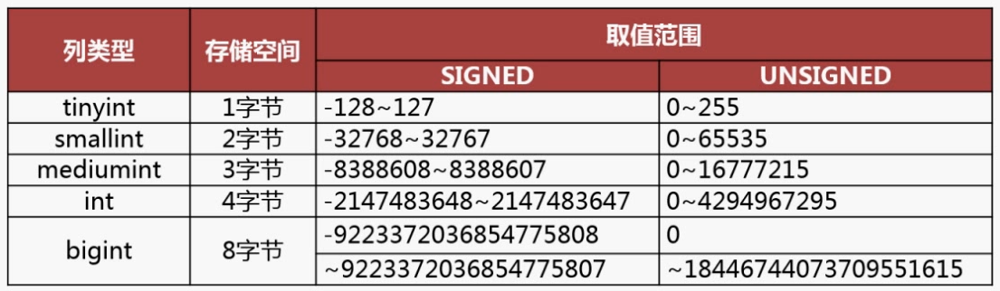

# MySQL

# MySQL基础

## 数据类型


## 索引分类

- 数据结构：**B+**树**索引、Hash索引、Full-text索引；**
- 物理存储：**聚簇索引（主键索引）、二级索引（辅助索引）；**
    - 主键索引B+树存储的是实际数据；
    - 二级索引B+树存储的是主键ID。
- 字段特性：**主键索引、唯一索引、普通索引、前缀索引；**
- 字段个数：**单列索引、联合索引。**

## B+树存储优势

1. B+树和B树
    1. B+树只在叶子节点存储数据，且叶子节点通过双向链表连接；
    2. B树非叶子节点也要存储数据。
2. B+树和二叉树
    1. B+树可以有多个子节点，极大地降低树的高度，降低IO次数；
    2. 二叉树只能两个子节点，磁盘IO次数多。
3. B+树和Hash
    1. B+树通过索引在等值查询和范围查询都有不错的性能；
    2. Hash只适合等值查询，无法范围查询。

## 索引创建

### 主键索引

- 一个表只能有一个主键索引

```sql
CREATE TABLE user(
	id int PRIMARY KEY auto_increment
);
```

### 唯一索引

- 一个表可以有多个唯一索引，但是每一个唯一索引列值必须是唯一的，允许空值

```sql
CREATE TABLE user(
	phone varchar(11) NOT NULL,
	UNIQUE INDEX idx_ph(phone)
);
```

### 普通索引

```sql
CREATE TABLE user(
	phone varchar(11) NOT NULL,
	INDEX idx_ph(phone)
);
```

### 前缀索引

- 前缀索引对字符类型前几个字符建立的索引，可以建立在char、varchar、binary、varbinary上；

```sql
CREATE TABLE user(
	phone varchar(11) NOT NULL,
	INDEX idx_ph(phone(6))
);
```

## 索引原则

### 是否创建索引

- 需要占用物理空间，数量越大，占用空间越大；
- 创建索引和维护索引要耗费时间，这种时间随着数据量的增加而增大；
- 会降低表的增删改的效率，因为每次增删改索引，B+ 树为了维护索引有序性，都需要进行动态维护。

### 使用索引

- 字段有唯一性限制的，比如uid；
- 经常用于WHERE查询条件的字段，这样能够提高整个表的查询速度，如果查询条件不是一个字段，可以建立联合索引。
- 经常用于GROUP BY、ORDER BY的字段这样在查询的时候就不需要再去做一次排序了，因为我们都已经知道了建立索引之后在 B+Tree 中的记录都是排序好的。

### 不使用索引

- WHERE 条件，GROUP BY，ORDER BY 里用不到的字段，索引的价值是快速定位，如果起不到定位的字段通常是不需要创建索引的，因为索引是会占用物理空间的。
- 字段中存在大量重复数据，不需要创建索引，比如性别字段，只有男女，如果数据库表中，男女的记录分布均匀，那么无论搜索哪个值都可能得到一半的数据。在这些情况下，还不如不要索引，因为 MySQL 还有一个查询优化器，查询优化器发现某个值出现在表的数据行中的百分比很高的时候，它一般会忽略索引，进行全表扫描。
- 表数据太少的时候，不需要创建索引；
- 经常更新的字段不用创建索引，比如不要对电商项目的用户余额建立索引，因为索引字段频繁修改，由于要维护 B+Tree的有序性，那么就需要频繁的重建索引，这个过程是会影响数据库性能的。

## 索引优化

- 前缀索引优化
- 覆盖索引优化
- 主键索引自增
- 索引设置为NOT NULL
- 防止索引失效：
    - 使用 like %xx 或者 like %xx%会导致索引失效；
    - 查询条件中对索引列进行计算、函数、类型转换操作等，都会导致索引失效；
    - 联合索引要能正确使用需要遵循最左匹配原则，也就是按照最左优先的方式进行索引的匹配，否则就会导致索引失效就；
    - 在 WHERE 子句中，如果在 OR 前的条件列是索引列，而在 OR 后的条件列不是索引列，那么索引会失效。

## 索引执行计划

```
+----+-------------+-------+------------+------+---------------+------+---------+------+------+----------+-------+                           
| id | select_type | table | partitions | type | possible_keys | key  | key_len | ref  | rows | filtered | Extra |                           
+----+-------------+-------+------------+------+---------------+------+---------+------+------+----------+-------+                           
|  1 | SIMPLE      | user  | NULL       | ALL  | NULL          | NULL | NULL    | NULL |    1 |   100.00 | NULL  |                           
+----+-------------+-------+------------+------+---------------+------+---------+------+------+----------+-------+ 
```

* possible_keys：字段可能用到的索引
* key：实际用到的索引
* key_len：索引长度
* rows：扫描数据行数
* type：数据扫描类型
  * All：全表扫描，最差； 
  * index：全索引扫描，不需要排序，索引本身就是有序的；
  * range：索引范围扫描，但是不需要排序，索引本身就是有序的； 
  * ref：非唯一索引扫描，通过索引定位到数据，然后进行小范围扫描；
  * eq_ref：唯一索引扫描，使用主键或唯一索引访问，通常出现在多表联查，关联条件为主键id或唯一索引；
  * const：结果只有一条的主键或唯一索引扫描，使用了主键或者唯一索引与常量值进行比较。