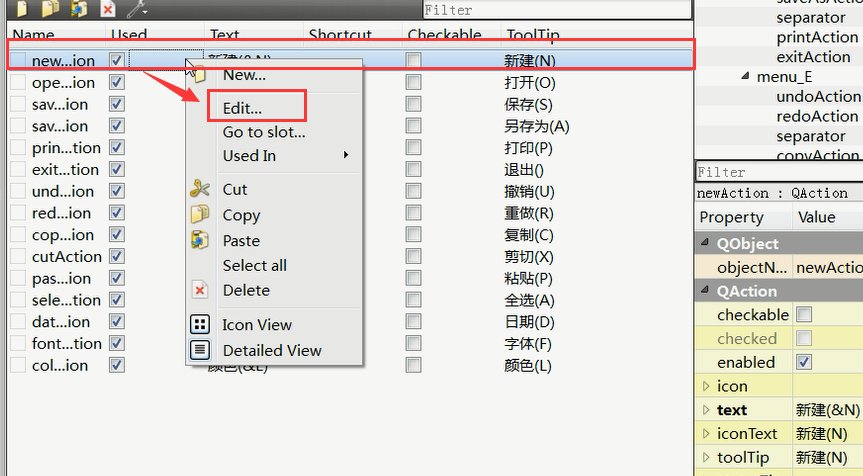
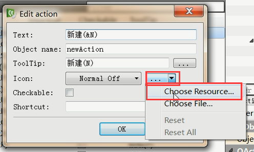
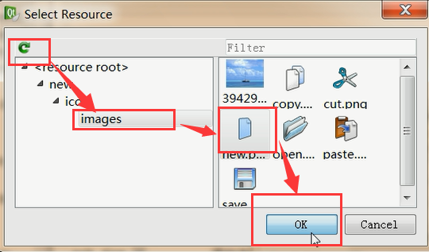
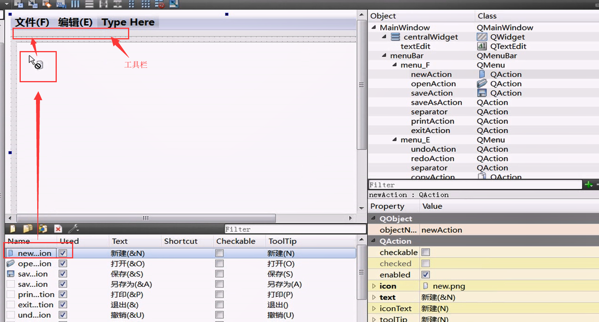
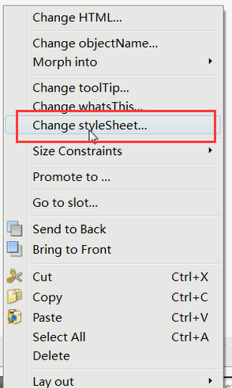
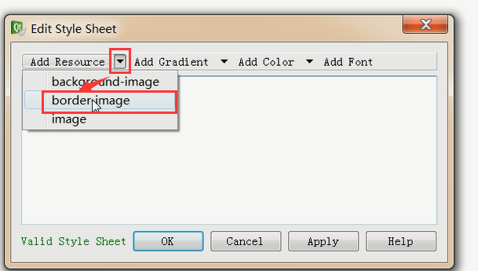
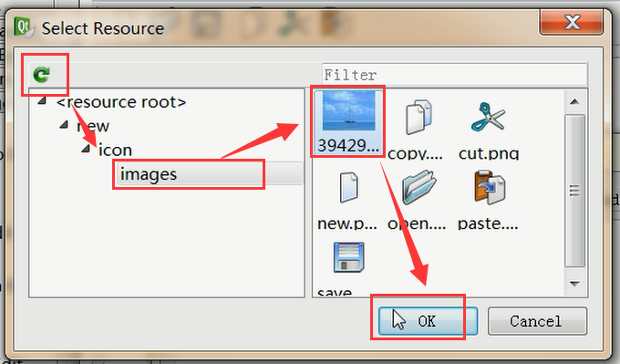

# notepad优化美工，加入图标

## 添加资源文件

* 选择工程右键 --- > Add New... ---> Qt ---> Qt Resource file ---> 点击choose ---> 输入Name：res ---> Next ---> Finish
* 把你的图片放入到你的Project项目中
* 选择Projects ---> Resources ---> 双击res.qrc ---> 下方找到Add,选择Add Prefix ---> 然后再点击Add Files 找到你的资源文件图片 --->全部选中，点击打开
* Ctrl + Shift + s ，全部保存一下，或者从File --> Save All，点击全部保存

> 成功之后在项目的路径下会有一个`res.qrc`文件

## 添加图表

> 点击`mainwindow.ui`进入，找到`Action Edit`，选择一个文件，右键选择`Edit`，

> 找到`Icon`，点击第二个三角，找到`Choowe Rseource`

> 点击刷新，找到`images`，选择图片，然后点击`OK`

## 工具栏添加图标

> 这个简单直接上图片就可以啦

## 为notepad添加背景图片

> 第一步文本框中右键，选择`Change styleSheet`

> 第二步，点击`border image`

> 第三步，选中图片

