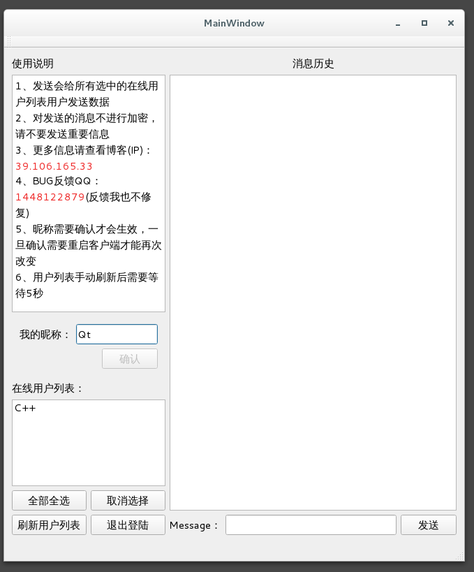

# Qt实现聊天室

> 可以自主选择在线用户发送消息

## 前情提要

> 目前我的阿里云服务器一直在运行这个小项目的服务端，至少我在写博客的时候一直在运行，如果那天发现客户端不能运行，十有八九是我的服务器这边把这个程序给关了，那么需要自己下载源文件修改IP和端口，然后自己运行服务器。客户端用Qt写的，服务器用的是`C++`，服务器使用的是`IO复用`的`epoll`的`LT模式`，实现了`Qt`和`C++`的一个结合应用的案例吧。如果需要了解程序运行的话，直接下载源文件即可，如果需要运行则需要下载打包好的程序就可以了。感兴趣的去看看源码即可，本人提供了源码，并有一定的简单粗鄙的注释，如果有问题，欢迎加首页的QQ群咨询。本程序支持中文输入。

## 简单介绍下

> 上面的分为了几个部分

* 使用说明

  > 对于本程序的一些简单的说明再次不再赘述了

* 我的昵称

  > 让用户输入唯一存在的昵称，且不能包含`@`和`#`这两个符号，这个作为了信息发送的一些边界的区分，所以禁止用户使用。一旦用户昵称确认后，除非重新登陆，否则将不能再次修改自己的昵称。如果用户的输入昵称和已经在线用户列表的昵称重复则会提示用户重新输入一个昵称。

* 在线用户列表

  > 在服务器维护了一个当前在线用户的列表，且打开客户端连接服务器成功不代表用户在线，输入昵称成功后才会出现在其他用户的列表中，且在线用户列表不会有自己的昵称存在，因为自己给自己发消息，个人觉得这毫无意义，所以把这种情况给排除了。

* 四个按钮

  * 全部全选

    > 选中当前所有的在线用户

  * 取消选择

    > 取消当前选中的用户

  * 刷新用户列表

    > 向服务器重新请求当前的在线用户列表

  * 退出登陆

    > 退出登陆且退出程序

* 消息历史

  > 显示你给别人发的和 别人给你发送的所有的消息记录

* `Message`和发送

  > 发送会把消息框中的数据发送给当前所有选中的在线用户。

## ppt和流程图下载

*   [基本架构](./Download/基本架构.vsdx)
*   [服务端流程图](./Download/服务器流程图.vsdx)
*   [客户端流程图](./Download/客户端流程图.vsdx)
*   [新用户登录](./Download/新用户登录.vsdx)
*   [发送接收消息](./Download/发送接收消息.vsdx)
*   [答辩ppt](./Download/通信原理.pptx)

## 打包好的Win程序

><a href="./Download/win_chat.rar">点击下载程序</a>

## 打包好的Linux程序

><a href="./Download/linux_chat.tar.gz">点击下载程序</a>

## 源代码客户端和服务器

> <a href="./Download/client_server_src.tar.gz">点击下载程序</a>

