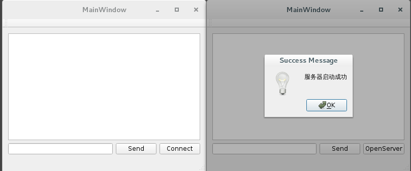
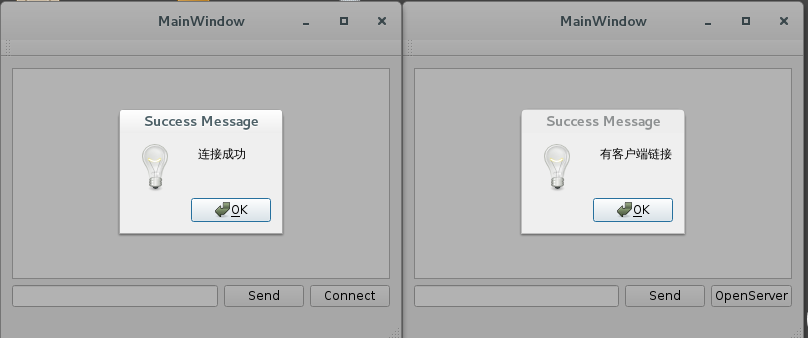
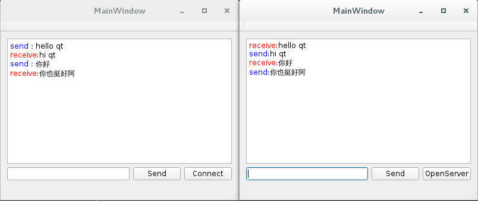

# Qt简单实现一对一聊天对话软件

##源码面前，了无秘密。

> 代码中有我的注释，本代码比较好理解，所以，我就不在这里多说了。
> 废话不多说直接上代码<a href="./Download/client_server_src.tar.gz">点击下载源码</a>

## 放两个打包好的程序

> 如果想要执行但是却没有编译器，不要怕，我已经打包好了
>
> <a href="./Download/tcpSocket.tar.gz">点击下载程序</a>

## 程序运行方法

> 第一步：服务器`server`点击`open server`
>
> 第二步：客户端`client`点击`connect`
>
> 第三步：开始会话，这个默认使用的是本地IP：`127.0.0.1` 端口号为：`6000`
>
> 第四步：就可以发消息了

## 放几张效果图出来

* 开启服务

* 客户端连接

* 进行对话

