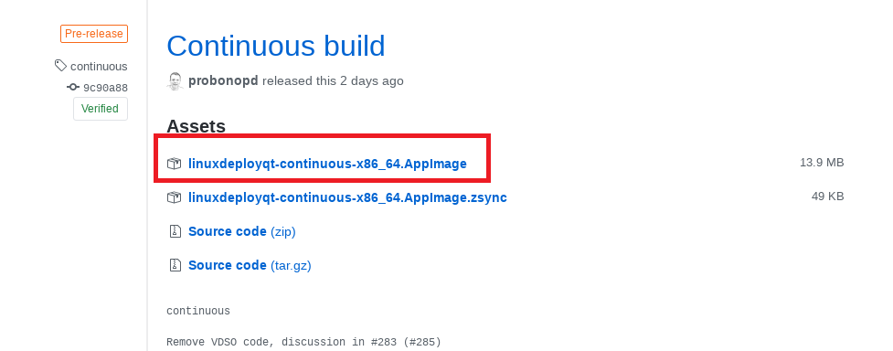
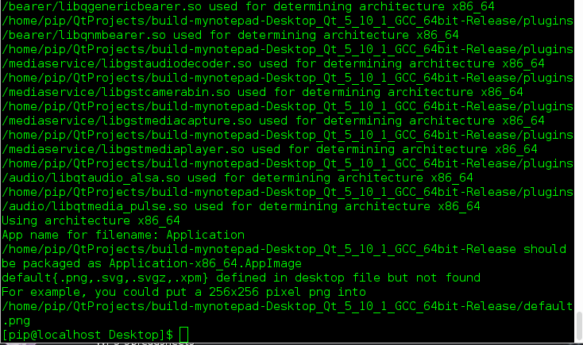

# linux下打包qt程序

## linux开发环境打包qt程序

参考文档:

https://jingyan.baidu.com/album/a3f121e4b5e848fc9052bbf3.html?picindex=2

https://blog.csdn.net/sy373466062/article/details/73480824

https://blog.csdn.net/u014746574/article/details/79288727#t2

https://blog.csdn.net/why19940926/article/details/76165763

> 由衷感谢以上大佬，没有大佬的博客就没有我的今天 (手动哭笑)

## 第一步配置下文件

> 使用你的IDE对程序进行Release编译一下，然后到你的工程文件中找到你的可执行文件，然后把它给移出来(最好移动到一个空的文件夹中)，如果有你的资源文件(图片、音乐... ...)也一并移出来，**然后新建一个文件为`pack.sh`，文件中的内容如下**：(有汉语备注的部分需要自己根据实际情况填充)
>
> ```
> #!/bin/sh  
> exe="test" #你需要发布的程序名称
> des="/home/someone/QtProject/build-test-Desktop-Release/Test" #步骤1中的目录即本文件所在目录
> deplist=$(ldd $exe | awk  '{if (match($3,"/")){ printf("%s "),$3 } }')  
> cp $deplist $des
> ```
>
> 再新建一个`name.sh`，`name`和你的**可执行文件的名字一样**。文件的内容为:
>
> ```
> #!/bin/sh  
> appname=`basename $0 | sed s,\.sh$,,`  
> dirname=`dirname $0`  
> tmp="${dirname#?}"  
> if [ "${dirname%$tmp}" != "/" ]; then  
> dirname=$PWD/$dirname  
> fi  
> LD_LIBRARY_PATH=$dirname  
> export LD_LIBRARY_PATH  
> $dirname/$appname "$@"
> ```
>
>  
>
> 新建一个`lib`的文件夹，把`/home/pip/Qt5.10.1/5.10.1/gcc_64/plugins/platforms`路径下的所有的文件移动到`lib`文件夹中，不同的`Qt creator`安装路径这个不同，所以根据实际情况选择路径。里面都是以`.so`结尾的文件。我的里面的文件，不知道通用不，我觉得应该是通用的<a href="./Download/platforms.tar.gz"><font color="red">点击下载</font></a>

## 第二步安装所需软件

## 下载linuxdeployqt

> 下载链接地址：https://github.com/probonopd/linuxdeployqt/releases
>
> <a href="./Download/linuxdeployqt-continuous-x86_64.AppImage"><font color="red">点击下载源文件</font></a>
>
> 下载第一个文件:
>
> 对这个软件进行处理(**如果提示权限不够则用管理员权限**)
>
> ```
> mv linuxdeployqt-continuous-x86_64.AppImage linuxdeployqt
> chmod u+x linuxdeployqt
> cp ./linuxdeployqt /usr/local/bin
> linuxdelpoyqt --version
> ```
>
> >第四行命令如果执行成功了会打印，`linuxdeployqt 4 (commit 9c90a88), build 542 built on 2018-04-21 08:13:26 UTC`，则说明OK，不成功检查二、三条命令，或者将二、三条命令替换为`chmod 555 linuxdeployqt`和`mv ./linuxdeployqt /bin/`

##还有一个软件需要安装

> 可以直接百度搜索
>
> <a href="./Download/patchelf-0.9.tar.gz"><font color="red">点击下载源文件</font></a>
>
> ```
> tar -vxf patchelf-0.9.tar.gz 
> cd patchelf-0.9/
> ./configure
> make
> sudo make install
> ```

##第三步添加qmake的到环境变量中

>`export PATH=$PATH:/home/pip/Qt5.10.1/5.10.1/gcc_64/bin/`
>
>我的qmake在这个路径下，所以需要添加这个路径，不同的`Qt creator`安装路径这个不同，所以根据实际情况选择路径。

## 最后一步进行打包

> 进入到你第一步移出来的那个要打包程序的文件中
>
> `linuxdeployqt  ./name  -appimage`name是你的要打包的可执行程序的名字，每个人的名字不同，然后就大功告成了，如果错误请检上面的步骤是否都是正确的，如下信息
>
> 

##成功打包的一个程序案例

> <a href="./Download/mynotepadPackage.tar.gz"><font color="red">点击下载源程序</font></a>
