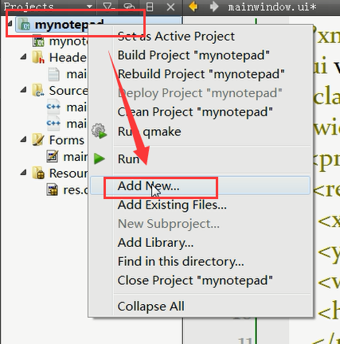
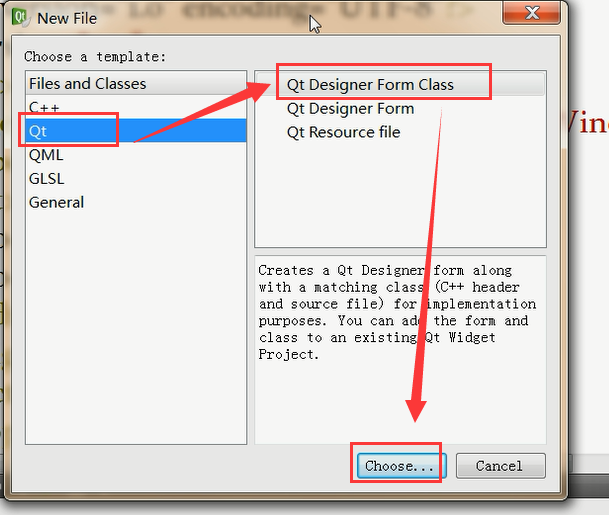
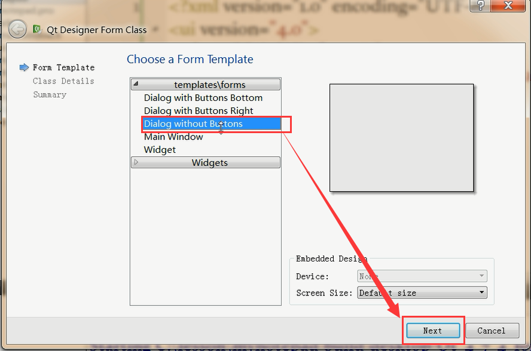
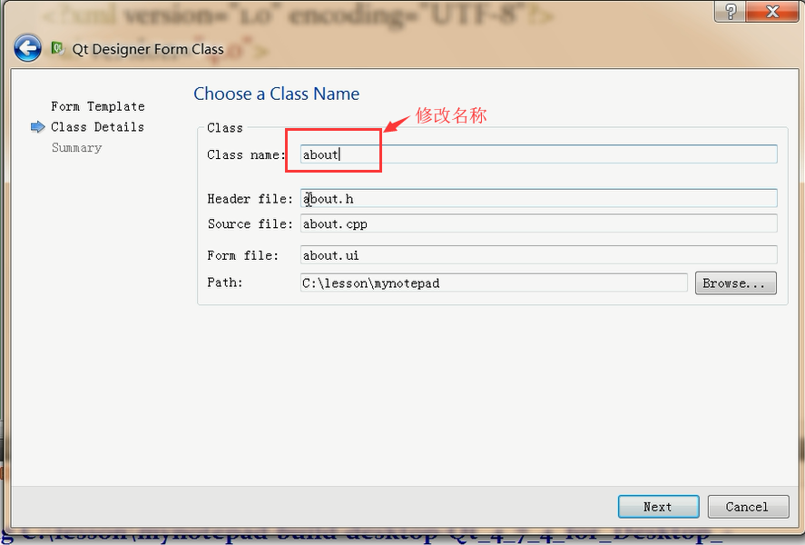

## 实现简单登陆框以及继续优化notepad

## 实现简单登陆框

> <a href="./Download/loginEncryption.tar.gz"><font color="red">点击下载源程序</font></a>

## 优化notepad

##添加关于官网服务

> qApp QcoreAppliation::instance();  //应用程序实例化全局指针
>
> 桌面服务：explorer，管理桌面上的所有服务，通过这个实现打开指定的网页
>
> url:全球唯一定位符

* QDesktopServices //桌面服务

  * bool openUrl(const QUrl &url)

    >url 构造：QUrl("http://www.baidu.com")

## 关于软件实现步骤

> 第一步



> 第二步



> 第三步



> 第四步



> 接下来会有一个相应的文件自动建立，点击`about.ui`进行编辑

## 添加动画功能

* QMovie

  > QMovie:播放`gif`图片,`gif`图片是由多个图片构成

  * 播放动画
    ```
    QLabel label;
    QMovie *movie = new QMovie("animations/fire.gif");

    label.setMovie(movie);
    movie->start();
    ```

  * movie->start(); //开始播放动画

  * movie->stop(); //停止播放动画


## 添加背景音乐

> 此方法在win上可以成功运行并可以播放音乐，可以为中文但是如果在linux上则最好不要用中文，否则会和我一样悲催。尝试了好久，最后灵机一动，改成英文成功，完美

<a href="./Download/note.tar.gz"><font color="red">点击下载源文件</font></a>

* QSound //播放背景音乐，

  > **使用这个类需要在你的 pro 文件中加入 QT += multimedia**

  ```
  QSound::QSound(const QString &filename, QObject *parent = Q_NULLPTR)
  ```

  * setLoops(int) //循环播放次数

    > 如果为-1则一直播放

  * play()//开始播放

  * stop()//停止播放


## 添加程序启动图片


* QSplashScreen

  ```
   int main(int argc, char *argv[])
    {
        QApplication app(argc, argv);
        QPixmap pixmap(":/splash.png");
        QSplashScreen splash(pixmap);
        splash.show();
        app.processEvents();
        ...
        QMainWindow window;
        window.show();
        splash.finish(&window);
        return app.exec();
    }
  ```

 * QPixmap

 * QTextCodec //使代码支持中文

    > 参考文档：
    >
    > https://blog.csdn.net/dbzhang800/article/details/6615252
    >
    > https://blog.csdn.net/dbzhang800/article/details/7325698
    >
    > Qt5只需要加`QTextCodec::setCodecForLocale(QTextCodec::codecForName("gb2312"));`就可以了,百度了一下Qt5已经支持中文了，所以不加这个也可以的。

    * QTextCodec::setCodecForCStrings(textc);

    * QTextCodec::setCodecForTr(textc);

    * QTextCodec::setCodecForLocale(textc);

      > textc应为`QTextCodec::codecForName("gb2312");`


## 打包成功后的程序

> linux系统打包程序，win未打包
>
> <a href="./Download/mynotepadPackage.tar.gz"><font color="red">点击下载源程序</font></a>
