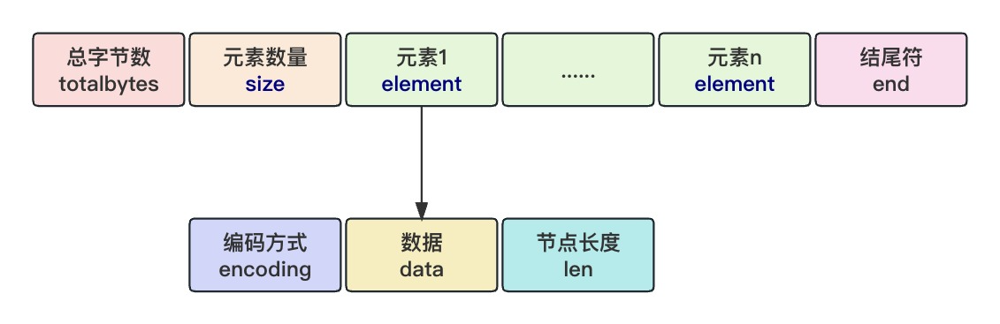
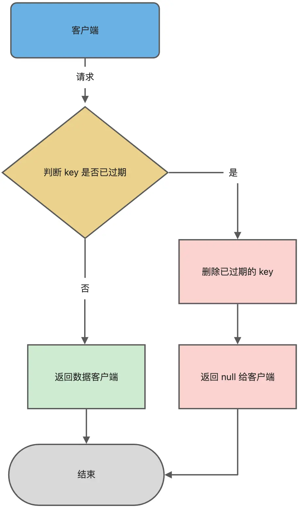

# Redis

## 数据结构

> Redis 6.0版本及以后支持的数据类型以及其他的功能。

* 数据类型
  * 基本：字符串(String)、哈希(Hash)、列表(List)、集合(Set)、有序集合(Sorted Set)；
  * 高级：位图(Bitmaps)、超日志(HyperLogLog)、地理位置(Geospatial)、流(Stream)。
* 其他：事务 、持久化、Lua 脚本、多种集群方案（主从复制模式、哨兵模式、切片机群模式）、发布/订阅模式，内存淘汰机制、过期删除机制

## 数据类型使用场景

* 基本数据类型

  - `String`：缓存对象、常规计数、分布式锁、共享`session`信息等。

  - `List`：消息队列（但是有两个问题：1. 生产者需要自行实现全局唯一 ID；2. 不能以消费组形式消费数据）建议使用(`Stream`)。

  - `Hash`：缓存对象、购物车等。

  - `Set`：聚合计算（并集、交集、差集）场景，比如点赞、共同关注、抽奖活动等。

  - `Zset`：排序场景，比如排行榜、电话和姓名排序等。

* 高级数据类型

  * `BitMap`：二值状态统计的场景，比如签到、判断用户登陆状态、连续签到用户总数等；
  * `HyperLogLog`：海量数据基数统计的场景，比如百万级网页 UV 计数等；
  * `GEO`：存储地理位置信息的场景，比如滴滴叫车；
  * `Stream`：消息队列，相比于基于 List 类型实现的消息队列，有这两个特有的特性：自动生成全局唯一消息ID，支持以消费组形式消费数据。

### 不同版本底层实现

| 数据结构 | 版本范围 | 底层实现 | 描述 |
| -------- | -------- | -------- | ---- |
| **String** | 全部版本 | `SDS` (Simple Dynamic String) | Redis 的字符串是动态字符串，可变长，底层是 `SDS`，支持二进制安全。 |
| **List** | < 3.2 | `ziplist` 或 `linkedlist` | 短小数据用 `ziplist` (压缩列表)，长数据用双向链表。 |
|      | ≥ 3.2 | `quicklist` | 将 `ziplist` 嵌套到双向链表中，减少内存碎片和指针开销，兼顾压缩和快速操作。 |
| **Hash** | < 3.0 | `ziplist` 或 `hashtable` | 小型数据用 `ziplist`，大型数据用哈希表。 |
|      | ≥ 3.0 | `ziplist` 或 `hashtable` | 底层实现未变，但优化了内存管理和多线程处理效率。 |
|      | ≥ 5.0 | `ziplist` 或 `hashtable` | 增加了对动态加载、异步删除的支持。 |
| **Set** | < 2.8 | `intset` 或 `hashtable` | 小型整数集合用 `intset`，其他用哈希表。 |
|      | ≥ 2.8 | `intset` 或 `hashtable` | 引入改进版 `hashtable`，提高查找效率。 |
|      | ≥ 3.2 | `intset` 或 `hashtable` | 增强了内存压缩特性和数据迁移效率。 |
| **ZSet** | 全部版本 | `ziplist` 或 `skiplist` | 小型数据用 `ziplist`，大型数据用跳表 (`skiplist`) 实现，跳表支持快速范围查询和排序操作。 |

### String

> 内部实现SDS

### List

> 内部实现`quicklist`，`quicklist`实际上是压缩列表(`zipList`)和双向链表(`linkedList`)的混合体，它将`linkedList`按段切分，每一段使用`zipList`来紧凑存储，多个`zipList`之间使用双向指针串接起来。

### Hash

> `redis 7.0`之前使用的压缩列表(`zipList`)或者哈希表(`hash table`)，之后使用紧凑列表(`listpack`)，`listpack`本质上仍然是字节数组，为了节省空间，它采用了多种编码方式来表示不同长度的整型和字符串。最后，它不再像 ziplist 一样元素还要记录上一个元素的大小，而是记录当前元素的大下，彻底解决了连锁更新的问题。

### Set

> Set 类型的底层数据结构是由**哈希表或整数集合**实现的。
>
> - 如果集合中的元素都是整数且元素个数小于 `512` （默认值，`set-maxintset-entries`配置）个，Redis 会使用**整数集合**作为 `Set`类型的底层数据结构；
> - 如果集合中的元素不满足上面条件，则`Redis`使用**哈希表**作为 Set 类型的底层数据结构。

### ZSET

> Zset 类型的底层数据结构是由紧凑列表(`listpack`)或跳表(`skip table`)实现的：
>
> - 如果有序集合的元素个数小于 `128` 个，并且每个元素的值小于 `64` 字节时，`Redis`会使用紧凑列表(`listpack`)作为`Zset`类型的底层数据结构；
> - 如果有序集合的元素不满足上面的条件，`Redis`会使用**跳表**作为`Zset`类型的底层数据结构。

## Redis持久化

* `AOF`(`Append Only FIle`)：所有写命令追加到文件(`appendonly.aof`)。
  * 优点：丢失数据少，每写操作及时同步到文件中；
  * 缺点：数据恢复慢，文件大，需要重新执行所有的命令；
  * 场景：对数据持久性要求高，且对性能影响可接受。
* `RDB`(`Redis Database`)：某个时间点的数据进行快照，保存为一个二进制文件(`dump.rdb`)，包含所有数据。
  * 优点：数据恢复快，文件小；
  * 缺点：丢失数据多，只能恢复到某一个时间点的数据；
  * 场景：数据丢失可接受，且注重性能的场景。
* 混合持久化：**前半部分是RDB**格式的全量数据，**后半部分是AOF**格式的增量数据。
  * 优点：开头为 RDB 的格式，使得 Redis 可以更快的启动，同时结合 AOF 的优点，有减低了大量数据丢失的风险。
  * 缺点：AOF 文件中添加了 RDB 格式的内容，使得 AOF 文件的可读性变得很差；

## 缓存设计

### 缓存雪崩&缓存击穿&缓存穿透

* 缓存雪崩：大量缓存数据在同一时间过期（失效）,请求直接访问数据库，导致数据库压力激增，引起连锁反应，导致系统崩溃。
  * **将缓存失效时间随机打散：** 我们可以在原有的失效时间基础上增加一个随机值（比如 1 到 10 分钟）这样每个缓存的过期时间都不重复了，也就降低了缓存集体失效的概率。
  * **设置缓存不过期：** 我们可以通过后台服务来更新缓存数据，从而避免因为缓存失效造成的缓存雪崩，也可以在一定程度上避免缓存并发问题。
* 缓存击穿：某个热点数据过期，大量请求访问该数据，无法从缓存获取，导致直接访问数据库。
  * 互斥锁方案（Redis 中使用 setNX 方法设置一个状态位，表示这是一种锁定状态），保证同一时间只有一个业务线程请求缓存，未能获取互斥锁的请求，要么等待锁释放后重新读取缓存，要么就返回空值或者默认值。
  * 不给热点数据设置过期时间，由后台异步更新缓存，或者在热点数据准备要过期前，提前通知后台线程更新缓存以及重新设置过期时间；
* 缓存穿透：当用户访问的数据，**既不在缓存中，也不在数据库中**。那么当有大量这样的请求到来时，数据库的压力骤增。
  * 非法请求的限制：判断求请求参数是否合理，请求参数是否含有非法值、请求字段是否存在，恶意请求直接返回错误，避免进一步访问缓存和数据库。
  * 设置空值或者默认值：针对查询的数据，在缓存中设置一个空值或者默认值，从缓存中读取到空值或者默认值，返回给应用，而不会继续查询数据库。 
  * 使用布隆过滤器快速判断数据是否存在，避免通过查询数据库来判断数据是否存在：在用户请求到来时，业务线程确认缓存失效后，可以通过查询布隆过滤器快速判断数据是否存在，且Redis 自身也是支持布隆过滤器的。

## 数据库和缓存如何保持一致性

1. 先更新数据库，后更新缓存

   > 出现缓存和数据库中的数据不一致的现象；

2. 先更新缓存，后更新数据库

   > 出现缓存和数据库中的数据不一致的现象；

3. 先更新数据库，后删除缓存(一定条件下可以保持一致性)

   > 可以保证数据一致性的，但是需要**保证删除缓存操作一定成功**

   * 消息队列：来重试缓存的删除，优点是保证缓存一致性的问题，缺点会对业务代码入侵。
   * 订阅`MySQL binlog` + 消息队列 + 重试缓存：的删除，优点是规避了代码入侵问题，也很好的保证缓存一致性的问题，缺点就是引入的组件比较多，对团队的运维能力比较有高要求。

4. 先删除缓存，后更新数据库

   > 先删除缓存，再更新数据库，在**读 + 写**并发的时候，还是会出现缓存和数据库的数据不一致的问题。

## 过期删除策略

### 常见过期删除策略

* 定时删除：在设置 key 的过期时间时，同时创建一个定时事件，当时间到达时，由事件处理器自动执行 key 的删除操作。
  * 优点：保证过期 key 会被尽快删除，也就是内存可以被尽快地释放。
  * 缺点：过期 key 比较多的情况下，删除过期 key 可能会占用相当一部分 CPU 时间。
* 惰性删除：不主动删除过期键，每次从数据库访问 key 时，都检测 key 是否过期，如果过期则删除该 key。
  * 优点：每次访问时，才会检查 key 是否过期，所以此策略只会使用很少的系统资源，因此，惰性删除策略对 CPU 时间最友好。
  * 缺点：这个过期 key 一直没有被访问，它所占用的内存就不会释放，造成了一定的内存空间浪费。
* 定期删除：每隔一段时间「随机」从数据库中取出一定数量的 key 进行检查，并删除其中的过期key。
  * 优点：限制删除操作执行的时长和频率，来减少删除操作对 CPU 的影响，同时也能删除一部分过期的数据减少了过期键对空间的无效占用。
  * 缺点：
    * 存清理方面没有定时删除效果好，同时没有惰性删除使用的系统资源少。
    * 难以确定删除操作执行的时长和频率。如果执行的太频繁，定期删除策略变得和定时删除策略一样，对CPU不友好；如果执行的太少，那又和惰性删除一样了，过期 key 占用的内存不会及时得到释放。

### Redis选择的定期删除策略

> 惰性删除+定期删除
>
> `Redis`在访问或者修改`key`之前，都会调用`expireIfNeeded`函数对其进行检查，检查`key`是否过期：
>
> - 如果过期，则删除该`key`，至于选择异步删除，还是选择同步删除，根据 `lazyfree_lazy_expire` 参数配置决定（`Redis 4.0`版本开始提供参数），然后返回`null`客户端；
> - 如果没有过期，不做任何处理，然后返回正常的键值对给客户端。

## 参考资料

* https://xiaolincoding.com/redis/
* https://www.cnblogs.com/hunternet/p/12624691.html
* https://blog.csdn.net/qq_32099833/article/details/133889244
