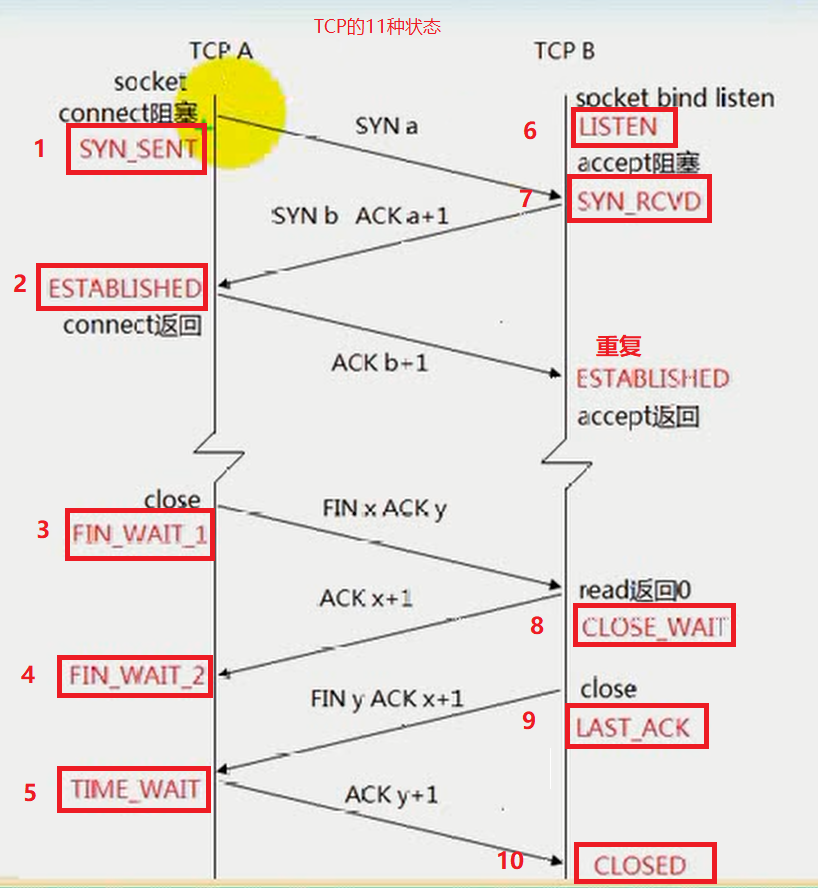

# day07

## 本章目标

* `TCP` 11种状态
* 连接建立三次握手、连接终止四次握手
* `TIME_WAIT`与`SO_REUSEADDR`
* `SIGPIPE`

## ACK、SYN和FIN
> 参考文档：
> https://zhidao.baidu.com/question/27114298.html
>
> `ACK`：是一种确认应答，在数据通信传输中，接收站发给发送站的一种传输控制字符。它表示确认发来的数据已经接受无误。
> `SYN`：攻击属于`DOS`攻击的一种，它利用`TCP协议`缺陷，通过发送大量的`半连接请求`，耗费CPU和内存资源。是最常见又最容易被利用的一种攻击手法。
> `FIN`：是用来扫描保留的端口，发送一个`FIN`包（或者是任何没有ACK或SYN标记的包）到目标的一个开放的端口，然后等待回应。许多系统会返回一个复位标记。

## TCP 11种状态



> **貌似有点不对啊，不是说是11种状态吗？？？怎么只有10种，莫非打错字了？？？NO！！！NO！！！NO！！！**
>
> **第十一种状态为：`CLOSING`**

> 关闭请求由双方都可以主动的发起，图中为客户端发起的中断连接，也可以是服务器发起中断连接。
>
> `TIME_WAIT`：保留两倍的`MSL`时间。
>
> > 参考：MSL，即 Maximum Segment Lifetime，一个数据分片（报文）在网络中能够生存的最长时间，在RFC793中定义MSL通常为2分钟，即超过两分钟即认为这个报文已经在网络中被丢弃了。对于一个TCP连接，在双方进入TIME_WAIT后，通常会等待2倍MSL时间后，再关闭掉连接，作用是为了防止由于FIN报文丢包，对端重发导致与后续的TCP连接请求产生顺序混乱，具体原理这里就不详细解释了，
>
> 参考链接：
>
> https://blog.csdn.net/qwertyupoiuytr/article/details/71436967

### CLOSING状态

> 如果客户端和服务器双方同时关闭`close`时，会产生此状态，建议参考连接。
>
> 参考文档：
>
> https://blog.csdn.net/dog250/article/details/52070680

### 验证查看ESTABLISHED、FIN_WAIT2状态

```
[pip@localhost code]$ netstat -an | grep tcp | grep 6000
tcp        0      0 0.0.0.0:6000            0.0.0.0:*               LISTEN 
tcp        0      0 127.0.0.1:34004         127.0.0.1:6000          ESTABLISHED
tcp        0      0 127.0.0.1:6000          127.0.0.1:34004         ESTABLISHED

[pip@localhost code]$ ps -aux | grep echosrv
pip       5332  0.0  0.1 149292  5356 pts/2    S+   11:25   0:00 vim echosrv.c
pip       5626  0.0  0.0   4176   348 pts/3    S+   11:26   0:00 ./echosrv
pip       5629  0.0  0.0   4176    92 pts/3    S+   11:26   0:00 ./echosrv
pip       5792  0.0  0.0 112664   968 pts/5    S+   11:31   0:00 grep --color=auto echosrv

[pip@localhost code]$ kill -9 5626
[pip@localhost code]$ netstat -an | grep tcp | grep 6000
tcp        1      0 127.0.0.1:34004         127.0.0.1:6000          CLOSE_WAIT 
tcp        0      0 127.0.0.1:6000          127.0.0.1:34004         FIN_WAIT2  
[pip@localhost code]$ 
```

## SIGPIPE信号

* 往一个已经接收`FIN`的套接字种写是允许的，接收到`FIN`仅仅代表对方不再发送数据

* 在收到`RST`段之后，如果再调用`write`就会产生`SIGNPIPE`信号，对于这个信号的处理，我们通常忽略即可

  > `signal(SIGPIPE, SIG_IGN);`

参考文档：

https://blog.csdn.net/aa838260772/article/details/39854323
