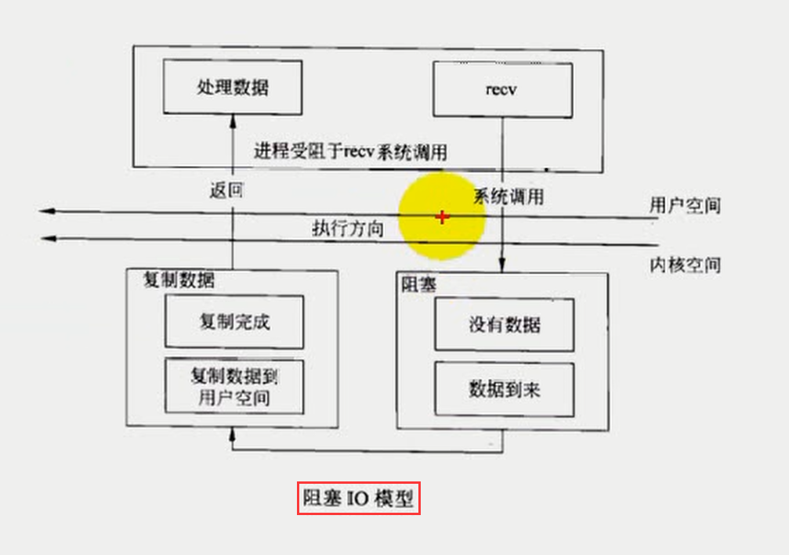
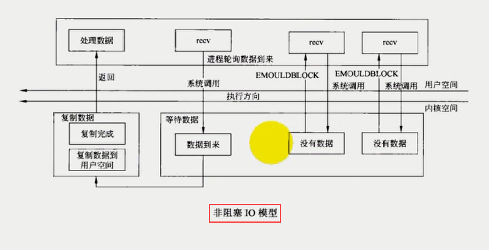
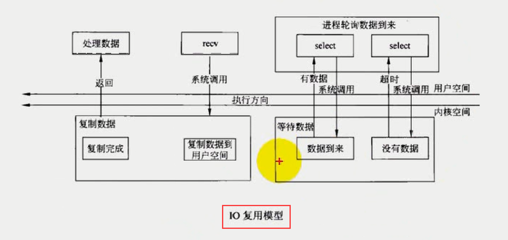
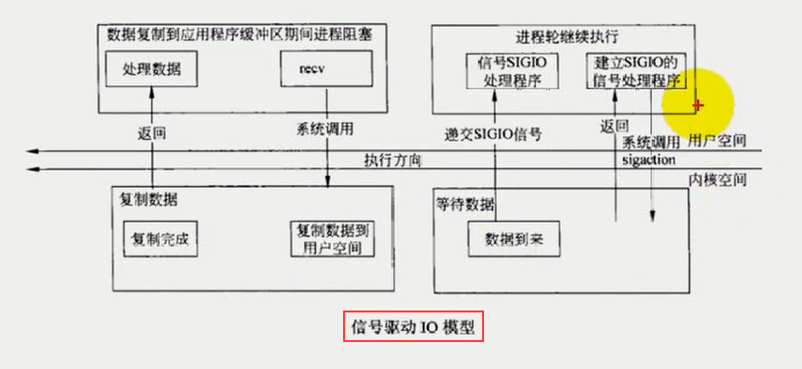
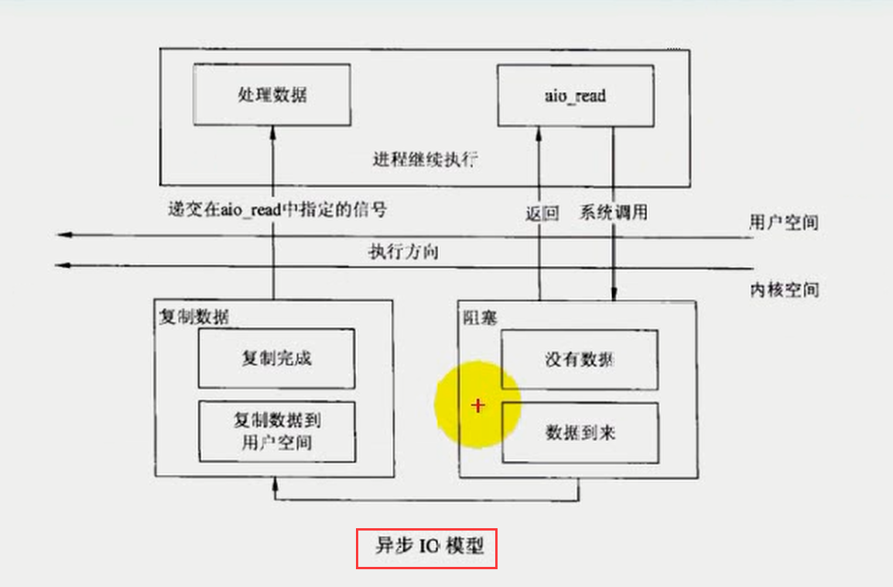

# day08

## 本章目标

* 五种`I/O`模型
* `select`
* 用`select`改进回射客户端程序

## 五种I/O模型

* 阻塞`I/O`
* 非阻塞`I/O`
* `I/O`复用(`select`和`poll`)
* 信号驱动`I/O`
* 异步`I/O`

## 1、阻塞I/O模型

> 阻塞等待数据到来。



## 2、非阻塞I/O模型

> **`忙等待`**，用的很少，程序一直在等待数据，没有数据相当于死循环，占用CPU资源。



> `fcntl(fd, F_SETFL, flag|O_NONBLOCK);`
>
> 详情查看本博客C语言部分：[跳转连接](http://39.106.165.33/#!./blog/C/4.C语言进程通信.md)
>
> PS：`EMOULDBLOCK`错误应当改为`EWOULDBLOCK`

```
NAME
       fcntl - manipulate file descriptor

SYNOPSIS
       #include <unistd.h>
       #include <fcntl.h>

       int fcntl(int fd, int cmd, ... /* arg */ );

DESCRIPTION
       fcntl() performs one of the operations described below on the open file
       descriptor fd.  The operation is determined by cmd.
       fcntl() can take an optional third argument.  Whether or not this argu‐
       ment  is  required is determined by cmd.  The required argument type is
       indicated in parentheses after  each  cmd  name  (in  most  cases,  the
       required type is int, and we identify the argument using the name arg),
       or void is specified if the argument is not required.
       
RETURN VALUE
       For a successful call, the return value depends on the operation:
       F_DUPFD  The new descriptor.
       F_GETFD  Value of file descriptor flags.
       F_GETFL  Value of file status flags.
       F_GETLEASE
                Type of lease held on file descriptor.
       F_GETOWN Value of descriptor owner.
       F_GETSIG Value of signal sent when read or write becomes  possible,  or
                zero for traditional SIGIO behavior.
       F_GETPIPE_SZ
                The pipe capacity.
       All other commands
                Zero.
On error, -1 is returned, and errno is set appropriately.
```

## 3、I/O复用



> 通过`select`来实现，通过`select`管理多个文件描述符。一旦由文件描述符监测到数据到来`select`就返回，然后调用`recv`函数对数据处理，

## 4、信号驱动I/O

> 不常用，非阻塞模式，有消息到来通过信号跳到消息处理函数，没有消息，处理其他事情。



## 5、异步I/O

> `效率最高的处理方式`。`aio_read`函数，有一个缓冲区，如果没有数据立即返回，有数据的话，把数据拷贝到应用层的缓冲区。复制完成后，通过信号通知应用层的数据。与第四种模型相似，但是又有很大区别。



## select模型 --->重点

> `man 2 select`，学会使用帮助手册。
>
> `select`：用来管理`fd`，地位：管理者，管理多个`I/O`，一旦其中的一个`I/O`监测到所感兴趣的事件，那么`select`函数返回，返回值为监测到事件的个数。并且返回那些`I/O`发生了那些事件。遍历事件然后进行处理，单进程处理比较好。

```
#include <sys/select.h>

/* According to earlier standards */
#include <sys/time.h>
#include <sys/types.h>
#include <unistd.h>

int select(int nfds, fd_set *readfds, fd_set *writefds, fd_set *exceptfds, struct timeval *timeout);

void FD_CLR(int fd, fd_set *set);
int  FD_ISSET(int fd, fd_set *set);
void FD_SET(int fd, fd_set *set);
void FD_ZERO(fd_set *set);

#include <sys/select.h>

int pselect(int nfds, fd_set *readfds, fd_set *writefds, fd_set *exceptfds, const struct timespec *timeout, const sigset_t *sigmask);
```

* `select`的参数说明：
  * `int nfds`：存放到读、写、异常的集合文件描述符的`最大值+1`。就是改参数的值。

  * `fd_set *readfds`：读的集合，如果有数据可读的套接口放在此集合，放的为文件描述符。**输入输出型参数。**

  * `fd_set *writefds`：写的集合，如果有数据可写的套接口放在此集合，放的为文件描述符。**输入输出型参数。**

  * `fd_set *exceptfds`：异常的集合**输入输出型参数。**

  * `struct timeval *timeout`：指定超时时间，`NULL`不设置超时时间。设置时间后如果没有监测到时间，也会返回返回值为`0`。**输入输出型参数。**

    ><font color=red size=5>`select`函数每次返回一次，都需要调用`FD_ZERO`和`FD_SET`，因为第二、三、四个参数都是输入输出型参数，返回后其值会发生变化，需要重新设置内容。</font>

    ```
    fd_set rset;
    FD_ZERO(&rset);
    int maxfd;
    int nready;
    char sendbuf[1024] = {0};
    char recvbuf[1024] = {0};

    int fd_stdin = fileno(stdin);//为了防止标准输入和输出被重定向所以用fileno转换stdin/stdout为fd
    if(fd_stdin > sock)//设置最大fd
    	maxfd = fd_stdin;
    else
    	maxfd = sock;
    while(1)
    {
        FD_SET(fd_stdin, &rset);//每次都需要添加在while循环,详情查看博客原因
        FD_SET(sock, &rset);
        nready = select(maxfd + 1, &rset, NULL, NULL, NULL);
        if(nready == -1)
        {
        	ERR_EXIT("select");
        }
        else if(nready == 0)
        	continue;
        if(FD_ISSET(sock, &rset))//判断是那个信号的，调其处理的函数
        {
        	int ret = readline(sock, recvbuf, sizeof(recvbuf));
        	if(ret == -1)
            {
            ERR_EXIT("readline");
            }
            else if(ret == 0)
            {
            printf("server close\n");
            break;
            }
        	fputs(recvbuf, stdout);
       		memset(recvbuf, 0, sizeof(recvbuf));
        }
        else if(FD_ISSET(fd_stdin, &rset))
        {
            if(fgets(sendbuf, sizeof(sendbuf), stdin) == NULL)
            break;
            writen(sock, sendbuf, strlen(sendbuf));
            memset(sendbuf, 0, sizeof(sendbuf));
        }
    }
    close(sock);
    return 0;
    ```
* `timeout`的结构体：

```
    The timeout
    The time structures involved are defined in <sys/time.h> and look like
    struct timeval {
        long    tv_sec;         /* seconds */
        long    tv_usec;        /* microseconds */
    };
    and
    struct timespec {
        long    tv_sec;         /* seconds */
       long    tv_nsec;        /* nanoseconds */
    };
    > (However, see below on the POSIX.1-2001 versions.)
```
* `select`的返回值：

```
    RETURN VALUE
    On success, select() and pselect() return the  number  of  file  descriptors  contained  in  the  three returned  descriptor  sets  (that  is,  the  total  number  of  bits that are set in readfds, writefds, exceptfds) which may be zero if the timeout expires before anything interesting happens.  On error,  -1 is  returned,  and errno is set appropriately; the sets and timeout become undefined, so do not rely on their contents after an error.
```

* 四个宏

  * `void FD_CLR(int fd, fd_set *set);`

    > 如果`fd`存在于集合中，将`fd`从集合中移除。

  * `int  FD_ISSET(int fd, fd_set *set);`

    > 判定`fd`是否再集合中，不会改变集合的内容。

  * `void FD_SET(int fd, fd_set *set);`

    >将`fd`添加到集合当中

  * `void FD_ZERO(fd_set *set);`

    > 将集合清空，即删除集合内所有的`fd`