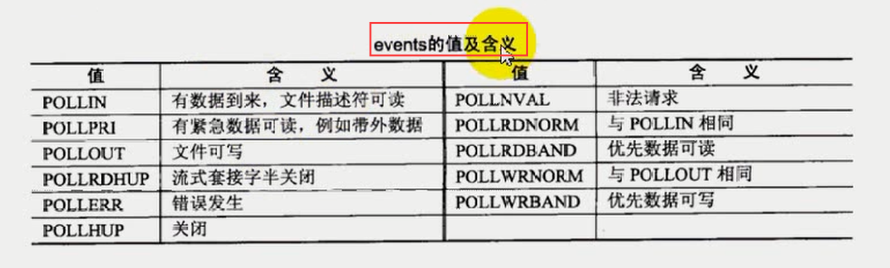

# day12

## 本章目标

* `select`限制
* `poll`，也是`I/O`复用函数

## select限制

* 用`select`实现的并发服务器，能达到的并发数，受两方面的限制

  * 一个进程所能打开的最大文件描述符限制，可以通过调整内核参数来改变，`ulimit -n`查看能打开的文件描描述符的大小，通过`ulimit -n num`：通过这条命令修改一个文件所能打开的最大文件描述符的限制，`num`为改变之后的最大文件描述符。这个命令只是临时修改，如果需要开机的时候改变的话则需要修改配置文件。

    > 发现几个`ulimit`的小坑，以下皆为个人猜想，有一定的实践操作佐证。
    >
    > `ulimit -n num`：如果是普通用户每次修改的文件描述符的`num`必须小于`ulimit -n`的数值的大小，否则会报错误`bash: ulimit: open files: cannot modify limit: Operation not permitted`，权限不够，emmm。如果是管理员则不会出现这个错误，可以修改成功。
    >
    > 即：管理员可以随意的改大改小，而普通用户只能不断的改小，不能改的比原来的最大能打开的文件描述符数量大。但是可以越改越小... ...。
    >
    > 今天下午又试了一次发现普通用户也可以把最大能打开的文件描述符数量增大。... .... 

  * `select`中的`fd_set`集合容量的限制(FD_SETSIZE，一般为1024)，这个需要重新编译内核。

## 这里是一条插播的关于vim内容

> 参考文档：
>
> ​	https://baike.1688.com/doc/view-d36947406.html

```
TAB就是制表符,单独拿出来做一节是因为这个东西确实很有用.
    >                 输入此命令则光标所在行向右移动一个tab.
    5>>                输入此命令则光标后5行向右移动一个tab.
    :12,24>            此命令将12行到14行的数据都向右移动一个tab.
    :12,24>>           此命令将12行到14行的数据都向右移动两个tab.
    那么如何定义tab的大小呢?有人愿意使用8个空格位,有人用4个,有的用2个.
    有的人希望tab完全用空格代替,也有的人希望tab就是tab.没关系,vim能
    帮助您.以下的配置一般也都先写入配置文档中,免得老敲.
    :set shiftwidth=4  配置自动缩进4个空格,当然要设自动缩进先.
    :set sts=4         即配置softtabstop为4.输入tab后就跳了4格.
    :set tabstop=4     实际的tab即为4个空格,而不是缺省的8个.
    :set expandtab     在输入tab后,vim用恰当的空格来填充这个tab.
命令模式
  	dG从前行一直删除到文件末尾。
	u：撤销操作，类似win的ctrl + z
	ctrl + r:重做上一个操作
```

##getrlimit和setrlimit

> 获取一个进程所能打开的最大文件描述符数目。

```
#include <sys/time.h>
#include <sys/resource.h>

int getrlimit(int resource, struct rlimit *rlim);
int setrlimit(int resource, const struct rlimit *rlim);
int prlimit(pid_t pid, int resource, const struct rlimit *new_limit, struct rlimit *old_limit);

resource:这里是获取进程能够打开的最大文件描述符个数，所以第一个参数为，RLIMIT_NOFILE。
RLIMIT_NOFILE
	Specifies a value one greater than the maximum file descriptor number that can be  opened  by  this  process. Attempts  (open(2), pipe(2), dup(2), etc.)  to exceed this limit yield the error EMFILE.  (Historically, this limit was named RLIMIT_OFILE on BSD.)

第二个参数的结构体：使用时自己不需要再定义了。
    struct rlimit {
        rlim_t rlim_cur;  /* Soft limit */
        rlim_t rlim_max;  /* Hard limit (ceiling for rlim_cur) */
    };

RETURN VALUE
       On success, these system calls return 0.  On error, -1 is returned, and errno is set appropriately.
```

## getrlimit和setrlimit函数使用代码

> 如果提示权限不够则使用管理员运行。

```
#include <stdio.h>
#include <stdlib.h>
#include <sys/types.h>          /* See NOTES */
#include <sys/socket.h>
#include <unistd.h>
#include <errno.h>
#include <netinet/in.h>
#include <arpa/inet.h>
#include <arpa/inet.h>
#include <string.h>
#include <signal.h>
#include <sys/time.h>
#include <sys/resource.h>

#define ERR_EXIT(err) {perror(err); exit(EXIT_FAILURE);}


int main()
{
        struct rlimit limit;
        if(-1 == getrlimit(RLIMIT_NOFILE, &limit))//获取本进程limit信息
        {
                ERR_EXIT("getrlimit");
        }
        printf("old: current = %lld max = %lld\n", limit.rlim_cur, limit.rlim_max);

        limit.rlim_cur = 2048;
        limit.rlim_max = 2048;

        if(-1 == setrlimit(RLIMIT_NOFILE, &limit))//重新设置
        {
                ERR_EXIT("setrlimit");
        }
        if(-1 == getrlimit(RLIMIT_NOFILE, &limit))//获取修改后的信息
        {
                ERR_EXIT("getrlimit");
        }
        printf("new: current = %lld max = %lld\n", limit.rlim_cur, limit.rlim_max);

        return 0;
}
```

## 测试一个进程可以打开的最大文件文件描述符

> 实际上`tag`只能到`1021`(ulimit 设置为1024时)。
>
> why？？？，因为还有三个系统已经给你打开的`标准输入0`、`标准输出1`和`标准错误2`。加起来刚好`1024`个。

```
#include <stdio.h>
#include <stdlib.h>
#include <sys/types.h>          /* See NOTES */
#include <sys/socket.h>
#include <unistd.h>
#include <errno.h>
#include <netinet/in.h>
#include <arpa/inet.h>
#include <string.h>
#include <signal.h>
#include <sys/select.h>

#define ERR_EXIT(err) {perror(err); exit(EXIT_FAILURE);}

//只作连接操作
int main()
{
        int tag = 0;
        while(1)
        {
                int sock;
                int i = 0;
                struct sockaddr_in servaddr;//一个服务器的地址

                sock = socket(PF_INET, SOCK_STREAM, IPPROTO_TCP);
                if(sock < 0)
                {
                        perror("创建scoket失败\n");
                        exit(EXIT_FAILURE);//退出程序
                }
                memset(&servaddr, 0, sizeof(servaddr));//初始化地址
                servaddr.sin_family = AF_INET;//地址族
                servaddr.sin_port = htons(6000);//端口号，网络字节序转化为主机字节序
                servaddr.sin_addr.s_addr = inet_addr("127.0.0.1");//指定服务端的地址

                int conn = -1;
                if((conn = connect(sock, (struct sockaddr *)&servaddr, sizeof(servaddr)) < 0))
                {
                        printf("连接服务器失败\n");
                        exit(EXIT_FAILURE);
                }

                //获取本地的地址
                struct sockaddr_in sockname;
                socklen_t addrlen = sizeof(sockname);
                if(0 > getsockname(sock, (struct sockaddr *)&sockname, (socklen_t *)&addrlen))
                {
                        perror("getsockname");
                        exit(EXIT_FAILURE);//退出程序
                }
                tag++;
                printf("%d\n", tag);
        }
        return 0;
}
```

> 部分程序运行结果(客户端)：这个结果有一定的问题，但也是正确的，请仔细阅读理解下面的对于这个原因的解释。
>
> ```
> 1019
> 1020
> 1021
> 创建scoket失败
> : Too many open files
> [pip@localhost code]$ 
> ```
> 服务器端理论应该为：`1020`个，因为不仅有`标准输入0`、`标准输出1`和`标准错误2`，还有一个监听套接`listenfd`占用了一个文件描述符。则最多接受`1020`个连接了。如果服务端一直保持不断开的话。那么客户端也只能连接`1020`个，但是由于服务器与客户端的链接关闭了，导致可以连接客户端多于`1020个`了。所以上面的客户端的运行结果有一定的问题，服务器的对客户端处理合适，客户端的最大连接到服务器的个数为`1020`个,短板效应。

## poll函数

> 也是并发服务器的函数，与`select`类似

```
#include <poll.h>

int poll(struct pollfd *fds, nfds_t nfds, int timeout);

struct pollfd {
    int   fd;         /* file descriptor */
    short events;     /* requested events */
    short revents;    /* returned events */
};
结构体的成员变量events：
The bits that may be set/returned in events and revents are defined in <poll.h>:

POLLIN //有数据可读时
	There is data to read.
POLLPRI
	There  is  urgent  data  to read (e.g., out-of-band data on TCP socket; pseudoterminal master in packet mode has seen state change in slave).

POLLOUT
	Writing now will not block.

POLLRDHUP (since Linux 2.6.17)
	Stream socket peer closed connection, or shut down writing half of connection.   The  _GNU_SOURCE  feature  test macro must be defined (before including any header files) in order to obtain this definition.

POLLERR
	Error condition (output only).

POLLHUP
	Hang up (output only).

POLLNVAL
	Invalid request: fd not open (output only).
```


##struct pollfd的events附录


