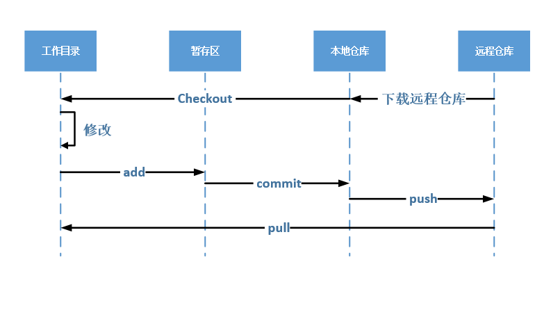
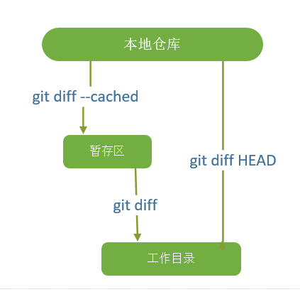
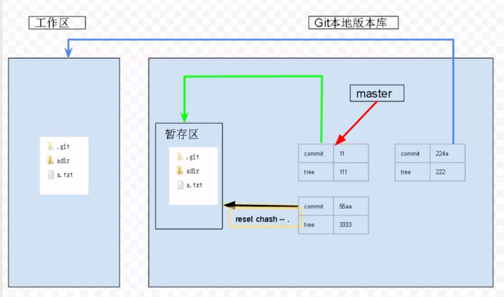

# Git

> `Git`是一个版本控制系统

## 下载安装Git

> [Git下载地址](https://git-scm.com/)，在这个网站下载`Windows`的客户端，安装不需要过多的操作，只需要无脑安装即可，即下一步就可以了。验证是否安装成功在`cmd`中输入`git --version`如果能出现`git`的版本信息即为安装成功。

## Git注册

> [Git注册地址](https://github.com/join)，注册成功后需要登录注册时的邮箱来验证，才是完整的注册成功。

## 简单配置

> 在你的`Windows`新建一个文件夹`source`，最好不含有中文，选中文件夹，右键使用`Git Bash Here`打开，会出现一个黑色窗口，在窗口中简单配置。
>
> `git config --global user.name yourname`
>
> `git config --global user.email youremail`
>
> PS：记得将`yourname`和`youremail`替换成你的用户名和邮箱地址，这样以后提交代码就到你的仓库中了。

## 获取帮助

> 在`Git Bash Here`中执行`git help`可以获取命令

## 克隆远程仓库到本地

> 与简单配置一样，需要用`Git Bash Here`打开一个文件夹
>
> `git clone 远程仓库的地址`，就可以把远程仓库克隆一份到本地。
>
> 例：` git clone https://github.com/ainihu/learngit.git`这个是我的一个仓库地址。

## 上传文件到远程仓库

> 在`cource/learngit`文件夹中新建一个文件，`add.txt`然后使用命令`cd learngit `，进入到`learngit`文件夹中，使用`git add add.txt`则将`add.txt`此时`add.txt`文件添加进入了暂存区。还没提交到仓库，使用`git commit`将暂存区的文件提交到本地仓库，此时需要对此次的提交添加注释。可以选择不添加。使用`git push`提交到远程仓库。

## 把远程文件改变到本地

> `git pull`与`git push`相对应，`git pull`是把远程仓库的数据同步到本地的仓库。

## 图解工作流程

## Git文件状态以及差异比较

> `git init 仓库名`
>
> `git status`查看当前的窗台
>
> `git diff`查看暂存区的文件和工作目录文件的不同
>
> `git diff HEAD`比较工作目录和本地仓库有哪些不同
>
> `git diff --cached`比较工作目录和本地仓库有哪些不同
>
> `gir rm --cached`从暂存区移除到工作目录

### 文件状态

### 差异比较

## Git分支

> 默认操作在`master`分支上，`git log`查看日志，`git commit` 不允许空的提交，但是通过加`--allow-empty`可以空提交，`-m`指定注释，这个前面提过了。

### 创建分支

> `git branch 分支名` ，例`git branch dev`
>
> 基于一个分支创建另一个分支，`git branch 分支2 分支1/分支1的hash值`，根据`分支1`创建`分支2`。

### 查看分支

> `git branch`，如果那个分支前面有`*`星号表示当前在那个分支上工作。
>
> `git branch -l`：查看本地分支
>
> `git branch -r`：查看远程分支
>
> `git branch -a`：查看全部分支

### 切换分支

> `git checkout 分支名`，切换到另一个分支，如果切换成功会提示。**创建并切换分支**`git checkout -b 分支名`

## Git别名

> `git config alias.logg log --oneline --all --decorate --graph"`给后面的字符串起别名则`git logg` 就等效于`git log --oneline --all --decorate --graph `

## Git查看分支内容

> `git ls-files -s`查看暂存区的内容
>
> `gir ls-tree 分支名`查看`commit`对象所指向的树的内容

## Git从缓存区恢复文件

> `checkout .`：从暂存区的所有文件恢复到工作目录，并覆盖
>
> `checkout --file`：从暂存区的所有文件恢复到工作目录，并覆盖
>
> `git cat-file -p:文件名`查看暂存的文件内容，只能查看当前分支的文件

## Git从本地仓库恢复文件

> `checkout HEAD .`：把本地仓库的所有文件恢复到暂存区和工作区，并覆盖
>
> `checkout HEAD --file`：把本地仓库的指定文件恢复到暂存区和工作区，并覆盖
>
> `git cat-file -p 分支名：文件名`：查看本地仓库的文件内容

## stash

> 如果一个分支的内容修改后没有`commit`到本地仓库，此时切换分支会出现错误，因为新的分支需要覆盖到当前的工作空间和暂存区，一个解决方法就是`commit`操作，另一个就是`stash`，`stash`可以使用多次。
>
> `stash`符合栈特性
>
> * `git stash`：把当前工作目录和暂存区的内容保存到另一个空间中。
> * `git stash list`：查看暂存区的列表
> * `git stash show -p stash@{0}`：查看`stash@{0}`的内容
> * `git stash pop`：弹出第一个`stash`应用到工作目录
> * `git stach drop`：删除第一个`stash`

## 合并分支

> `git merge 分支名`：把分支与当前分支进行合并

### 三方合并

> 1. 当前分支(提交)内容
> 2. 要合并的分支(提交)内容
> 3. 共同的一个祖先提交的内容

### 合并冲突产生

> 两个分支同时修改了同一个文件，导致两个分支合并时产生冲突

### 解决冲突

> * 手动解决，修改冲突的文件，再提交到暂存区。
>
> * `git mergetool`：解决冲突的工具(有多个)，如果未配置，选择默认的，敲回车进行冲突解决。
>
>   * 配置`mergetool`[参考工具及教程](https://blog.csdn.net/lpayit/article/details/70188391)
>     1. `git config --global merge.tool 工具名`
>     2. `git config --global mergetool.工具名.path “工具的路径”`
>
> * 合并分支之后会在合并之后生成一个后缀为`.orig`是合并冲突的文件。
>
> * `reset` ：撤销操作，重置到某个提交
>
>   > `git reset --hard 某个提交对应的hash值`，`git logg`查看提交记录，`logg`是别名，前面提过
>
> > PS：`git`会忽略`.gitignore`文件里写的的所有文件，如果不打算让`git`管理的文件，则写到`.gitignore`文件中即可，虽然被忽略，但是里面的文件仍然可以提交到仓库。

## pycharm的Git操作

> 打开一个``git`本地仓库(即包含`.git`文件)
>
> 1. `Ctrl + Alt + s`打开一个`git`项目
> 2. `Ctrl + k/Ctrl + shift + k`：快速提交，进行一次`commit`操作
> 3. `Ctrl + t`：更新
> 4. `PyCharm`：右下角有`Git:分支名`，可以通过点击切换分支。
> 5. 选中`git`仓库名，右键`Git ---> Repository ---> Merge Changes`合并分支。
> 6. `PyCharm`左下角的`Version Control` 的 `Log窗口`图形化显示分支，与`git logg`相同。

## 合并分支rebase

> 完整命令形式：`git rebase --onto newbase start branch`
>
> 省略命令形式：`git rebase start`
>
> * `--onto newbase`缺省的默认值：`start`一致
> * `branch`缺省默认值：`HEAD`
>
> 常用格式：
>
>  	1. 保证当前在`dev`分支
> 		2. `git rebase master`
> 		3. `git checkout master`
> 		4. `git merge dev`
>
> `rebase`与`merge`目的一样效果不同，下面举个例子：
>
> 1. 有如下分支：需要将`master分支`与`dev分支`合并到`master分支`
>
>    
>
> 2. `merge`合并后如下：
>
>    
>
>    > 从中可以看出弊端，合并后会生成一个`c6文件`，不仅如此，还导致这个分支成为了一个图一样的复杂，如果工程量大的话，就会很难去关系分析，那么就需要`rebase`登场了。
>
> 3. `rebase`合并如下：`git rebase --onto master master dev`
>
>    
>
>    > 显然这样合并分支要比`merge`合并分支要好，高下立判。
>

### rebase底层步骤

>1. 切换分支
>
>2. 计算差值(`branch-start`)
>
>   2.1 `dev`：C5、C4、C1、C0
>   
>   2.2`master`：C3、C2、C1、C0
>
>   2.3 `dev - master`：C5、C4  (`dev`减去`master`)
>
>3. 重置分支
>
>4. 应用集合到当前分支

## 远程分支、本地分支和跟踪分支

### 把远程仓库的合并到本地

> * `git fetch`命令用于从另一个存储库下载对象和引用。 还需要执行`git merege origin/master`才是合并到本地仓库，否则只是下载了下来。
> * `git pull`命令用于从另一个存储库或本地分支获取并集成(整合)。`git pull`命令的作用是：取回远程主机某个分支的更新，再与本地的指定分支合并。 
>
> 跟踪分支：跟踪分支是本地分支和远程分支建立了关系。当执行`git pull`时，把远程分支合并到本地分支时，可以知道该合并到哪里去，同理`git push`时，也知道把本地分支的内容提交到远程分支时该合并到哪里去。
>
> 查看跟踪分支：`git branch -vv`，获取帮助`git branch --help`

## git reset 命令

> `git reset`常用命令：
>
> * `git reset chash --[.|fileName]`，重置暂存区，`chash`可以省略，默认是`HEAD`点。
>
> * `git reset --soft chash`，只更新分支的`commit`到上一个提交(回退一个提交)，不更新暂存区和工作区。应用场景：提交说明写错了，可以使用该命令。
>
>   * `git commit --amend -m ‘说明’`：修改最后一次提交的说明，同上。
>
> * `git reset --mixed chash`，更新分支的`commit`值，重置暂存区，不重置工作目录。
>
> * `git reset --hard chash`，重置`commit`值，重置暂存区，重置工作目录。
>
> * `git reset chash`：默认选项为`mixed`。
>
>   > `chash`：`commit`的`hash`，或者是工作分支。
>
> `git ls-files -s`：查看暂存区的内容。
>
> `git ls-tree master`：查看`master`分支的内容。
>
> `ll`：查看工作目录的内容。

## 交互式rebase

> `git rebase -i --onto newbase start branch`要较为强大。

## cherry-pick命令

>把某个提交的修改应用到当前分支上，`git cherry-pick hash`，把`hash`哈希值对应的提交应用到当前分支上。

## revert命令

> 取消`commit`的修改，进行反向操作。即为`undo`操作
>
> `git revert hash`，撤销`hash`对应的操作。
>
> 如果需要撤销`merge`的操作需要指定一个主线，恢复到那个状态？，需要加`-m`参数来指定一个主线。`-m`主线指定的是第几个主线，通过`git show 合并节点的hash `查看是把第几条线作为主线合并。