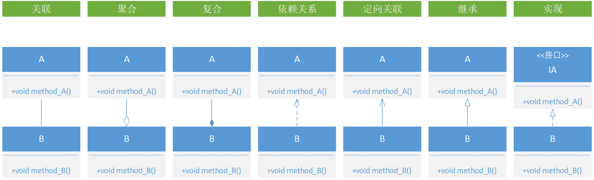

# UML学习

## 参考链接

* https://design-patterns.readthedocs.io/zh_CN/latest/read_uml.html
* https://blog.csdn.net/tianhai110/article/details/6339565

## 目的

> 最近准备拜读《设计模式之禅》但是中间出现了很多了类图，虽然自己曾经学过UML但是由于学习时间长等原因导致自己竟不认识了，所以这里算是复习加笔记。 

## 类成员属性

|    属性     | 符号 |
| :---------: | :--: |
|  `public`   | `+`  |
|  `private`  | `-`  |
| `protected` | `#`  |
|  `package`  | `~`  |

> 这里根据`visio 2013`版的类图整理出来的关系(七种)：关联、聚合、复合、依赖关系、定向关联、继承、实现。

## 结语

> 推荐看参考链接的两篇文章，这两篇文章内容类似，可以都看一看算是复习补充，自己就不再自己造轮子了。