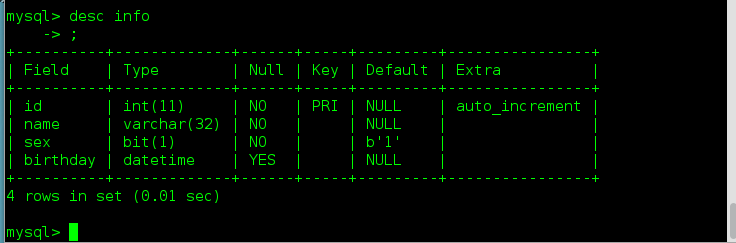
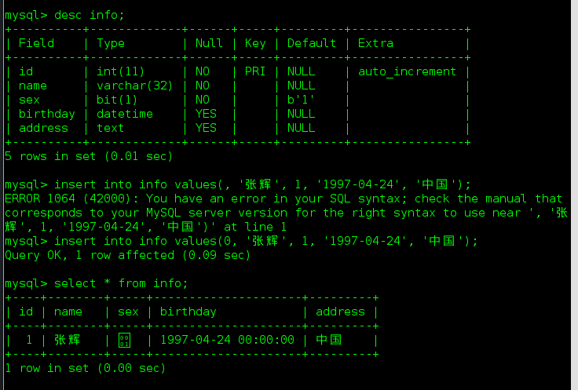
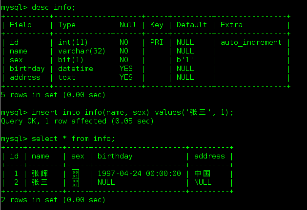

# 数据库

## E-R模型

> E表示`entry`，实体
>
> R表示`relationship`，关系

* 两个实体之间的对应规则
  * 一对一
  * 一对多
  * 多对多

## 三范式

* 第一范式（1NF）：列不可拆分，即同一列中不能有多个值。
* 第二范式（2NF）：唯一标识，每个表必须有一个数据元素为关键字
* 第三范式（3NF）：引用主键，表中所有的元素不但要能唯一地被主键关键字所表示，而且之间相互独立，不存在其他的函数关系。

## 字段类型

* 数字：`int`,`decimal(小数)`
* 字符串：`char`, `varchar`, `text`
* 日期：`datetime`
* 字节：`bit`

## 约束

* 主键`primary key`，只能有一个
* 非空`not null`
* 唯一`unique`，可以有多个
* 默认`default`
* 外键`foreign key`

## 本机连接退出数据库

> `mysql -uroot -p`
>
> * `-u`：`user`
> * `-p`：`password`
>
> 如果需要远程连接数据库可以通过`-h`指定要连接的主机ip
>
> * `-h`：`--host=host_name, -h host_name`
>
> 命令提示符为mysql时表示连接数据库成功
>
> 退出命令为：`quit`、`exit`、`\q`

学会`man mysql`

## 数据库操作

* 显示当前所有数据库

  > `show databases;`

* 创建数据库

  > `create database 数据库名 charset=utf8;`记得指定字符集

* 删除数据库

  > `drop database 数据库名;`

* 切换数据库

  > `use 数据库名;`

* 查看当前选择(连接)的数据库

  > `select database();`

## 表操作

* 查看当前数据库中所有表

  > `show tables;`

* 创建表

  * `auto_increment`表示自动增长

      >`create table 表名(列及类型);`
      >
      >例：
      >
      >```
      >create table info(
      >	id int auto_increment primary key not null,
      >	name varchar(32) not null,
      >	sex bit default 1 not null,
      >	birthday datetime);
      >```

* 查看表结构

  > `desc tablename;` desc是describe的缩写
  >
  > 例：
  >
  > 

* 修改表

  > `alter table 表名 add|change|drop 列名 类型;`
  >
  > `add`：添加列
  >
  > `change`：修改列，名字不能改，只能修改类型
  >
  > `drop`：删除列
  >
  > 例：
  >
  > `alter table info add birthday datetime`

* 删除表

  > `drop table 表名;`

* 更改表名称

  > `rename table 原表名 to 新表名`

* 查看表的创建语句

  > `show create table 表名`

## 数据操作

* 查询

  > `select * from 表名;`

* 增加

  > 全列插入：`insert into 表名 values(...);`
  >
  > 
  >
  > > 有一个小错误，第一次插入没有添加`id`所以报错了，`id`必须要填一个用来占位。
  >
  > 缺省插入：`insert into 表名(列1, ...) values(值1, ...);`
  >
  > 
  >
  > 同时插入多条数据：`insert into 表名 values(...), (...) ...;`或者`insert into 表名(列1, ...) values(值1, ...), (值1, ...)...;`
  >
  > * 主键列是自动增长，但是在全列插入时需要占位，通常使用0，插入成功后以实际数据为准
  >
  > * 修改
  >
  >   ```
  >   update 表名 set 列1=值1, ... where 条件
  >   ```
  >
  > * 删除
  >
  >   `delete from 表名 where 条件;`
  >
  >   > 从表中彻底删除，无法恢复
  >
  > * 逻辑删除
  >
  >   `alter table 表名 add 列名 bit default 0;`
  >
  >   > 将某一列的值全部设置为同一个值。即设置一个`isdelete`列标记表是否被删除了。
  >
  > 

## 备份与恢复

* 数据备份

  * 进入超级管理员

    > `sudo -s`

  * 进入mysql库目录

    > `cd /var/lib/mysql`

  * 运行`mysqldump`命令

    > `mysqldump -uroot -p 数据库名 > ~/Desktop/备份文件.sql;`
    >
    > 按照提示输入`mysql`的密码

* 数据恢复

  * 连接`mysql`，创建数据库

  * 退出连接，执行如下命令

    > `mysql -uroot -p 数据库名 > ~/Desktop/备份文件.sql`
    >
    > 根据提示输入`mysql`密码	
