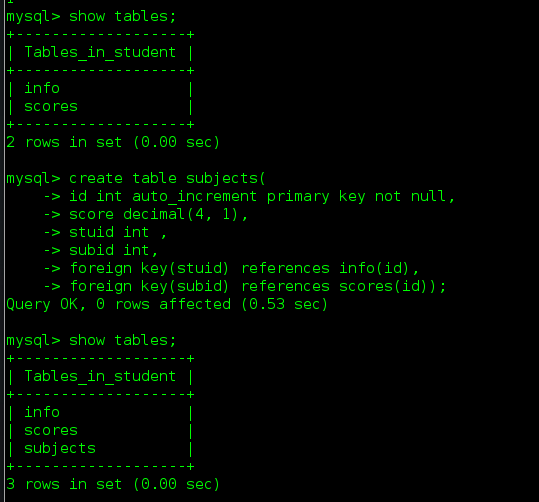
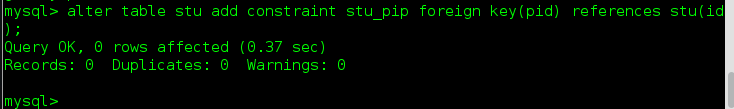
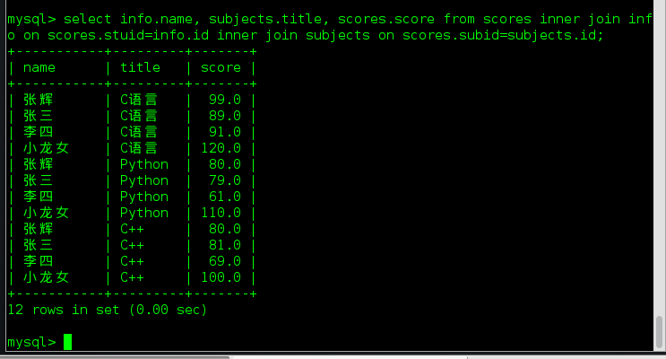
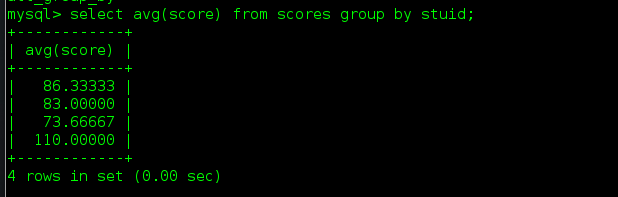
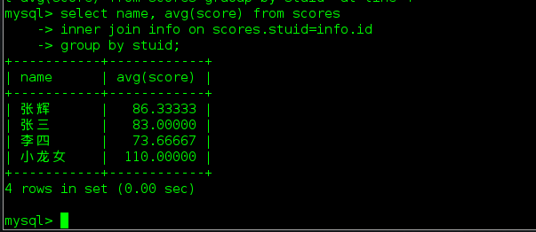

# 数据库高级操作

## 简介

* 实体与实体之间有3种关系，这些关系也需要存储下来
* 视图用于完成查询语句的封装
* 事物可以保证复杂的增删改操作有效性
* 当数据巨大时，为了提高查询速度可以通过索引实现

## 关系

> 先创建另一张表
>
> ```
> create table scores(
> id int primary key auto_increment,
> stuid int,
> subid int,
> score decimal(5,2));
> ```

### 建立关系

* 外键约束

  * 创建表的时候就添加外建

    > ```
    > create table scores(
    > id int primary key auto_increment,
    > stuid int,
    > subid int,
    > score decimal(5,2)
    > foreign key(当前表的字段) references 要引用的表(要引用的表的字段)
    > );
    > ```

    
  * 创建表之后再添加外键

    >```
    >alter table socres add constraint str_sco foreign key(stuid) references info(id)
    >```

    * 此时插入或者修改数据时，如果`stuid`的值在`info`表中不存在则会报错
    * 创建表时可以直接创建约束

    

* 外键的级联操作

  * 在删除`students`表的数据时，如果这个`id`值在`scores`中已经存在，则会跑出异常则会抛异常

  * 推荐使用逻辑删除，还可以解决这个问题

  * 可以创建表时指定级联操作，也可以在创建表后再修改外键的级联操作

    > 语法
    >
    > ```
    > alter table scores add constraint stu_sco foreign key(stuid) references student(id);
    > ```
    >

  * 级联操作的类型包括

    * `restrict(限制)`：默认值，抛异常
    * `cascade(级联)`：如果主表的记录删除，则从表中相关联的记录都将被删除
    * `set null`：将外键设置为空
    * `no action`：什么都不做

## 查询

### 连接查询

```
select students.name, subjects.title, scores.score
from scores
inner join students on scores.stuid=students.id
inner join subjects on scores.subid=subjects.id;
```



### 连接查询分类

* 表A `inner join` 表B：表A与表B匹配的行会出现在结果中
* 表A `left join`  表B：表A与表B匹配的行会出现在结构中，外加表A中独特的数据，未对应的数据使用`null`填充
* 表A `right join`  表B：表A与表B匹配的行会出现在结果中，外加表B中独有的数据，未对应的数据使用`null`填充





### 结论

> 当需要对有关系的多张表进行查询时，需要使用连接查询`join`。

## 内连接查询

> 内链接：`[inner] join`，`inner`可以省略从左表中取出每一条记录，去右表中与所有的记录进行匹配，匹配必须是某个条件在左表与右表中相同最终才会保留结果，否则不保留。可以没有连接条件，系统会保留所有结果。
>
> `左表 join 右表 on 左表.字段 = 右表.字段;`
>
> * `on`：表示连接条件，条件字段就是代表相同的业务含义
>

## 外连接查询

> `outer join`，以某张表为主，取出里面的所有记录，然后每条与另一张表进行连接，不管能不能匹配上条件，最终都会保留。能匹配上，正确保留，不能匹配，其他表的字段都置为NULL。
>
> * 左表为主(左连接)：`左表 left join 右表 on 左表.字段 = 右表.字段;`
> * 右表为主(右连接)：`左表 right join 右表 on 左表.字段 = 右表.字段;`

## 自然连接

> `natural join`：自动匹配连接条件，系统以字段名字作为匹配模式（同名字段作为条件，多个同名字段都作为条件）
>
> * 自然内连接：`左表 nartual join 右表;`
> * 自然外连接：`左表 nartual left/right join 右表;`

## 外键

> 关联关系(表和表之间：表中字段指向另外一张表的主键)
>
> * 外键条件：字段类型必须一致，存储引擎为`innodb`
> * 外键约束：
>   * 子表约束：不能插入父表不存在的记录
>   * 父表约束：三种约束模式(district, cascade, set null)，`on delete set null` 、`on update cascade`
>     * 禁止方式(no action / restrict)
>     * 级联方式(cascade)
>     * 置空方式(set null)