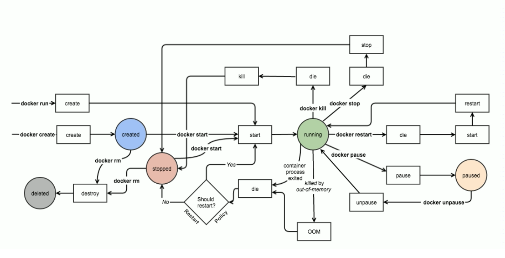

# Docker学习入门

> 学习链接：
>
> https://mp.weixin.qq.com/s/YuEWK9CN76phvUOXmATeEA
>
> https://www.yiibai.com/docker/docker-introduction.html

## Dockerfile

> Dockerfile文件说明不区分大小写，但是尽量使用大写字母。Docker从上到下的顺序运行Dockerfile的执行，为了制定基本镜像，第一条指令必须是`FROM`。`#`开头的字符为注释。

### Docker文件中使用的指令

* `RUN`：`FROM ubunt`，设置后续指令的基本映像。
* `CMD`
* `FROM`
* `EXPOSE`
* `ENV`

> `docker build -f /path/to/a/Dockerfile`，`-f`指定`Dockerfile`文件
>

## 主机级虚拟化：

* Type-1：直接在硬件平台装虚拟机管理器
* Type-2：硬件之上安装操作系统，再在操作系统上装虚拟机管理平台，VMware

> 内核：主要来管理资源空间分配。
>
> Linux两颗树：进程树和文件系统树。

### Linux Namespaces

| namespace | 系统调用参数  | 隔离内容                   | 内核版本 |
| --------- | ------------- | -------------------------- | -------- |
| UTS       | CLONE_NEWUTS  | 主机名和域名               | 2.6.19   |
| IPC       | CLONE_NEWIPC  | 信号量、消息队列和共享内存 | 2.6.19   |
| PID       | CLONE_NEWPID  | 进程编号                   | 2.6.24   |
| Network   | CLONE_NEWNET  | 网络设备、网络栈、端口等   | 2.6.29   |
| Mount     | CLONE_NEWNS   | 挂载点(文件系统)           | 2.4.19   |
| User      | CLONE_NEWUSER | 用户和用户组               | 3.8      |

## 容器级虚拟化

* cgroups
  * blkio：块设备IO
  * cpu：CPU
  * cpuacct：CPU资源使用报告
  * cpuset：多处理器平台上的CPU集合
  * devices：设备访问
  * freezer：挂起或恢复任务
  * memory：内存用量及报告
  * perf_enent：对cgroup中的任务进行统一性能测试
  * net_cls：cgroup中的任务创建的数据报文的类别标识符

## LXC(linux Container)

> 在内核级别支持了容器虚拟化，提供了方便的操作接口，但是是通过模板脚本，下载到本地完成安装过程。生成，创建、迁移、批量拷贝比较麻烦。学习必要的工具，定制模板。

## Docker

> 早期Docker用LXC做容器管理引擎，在创建容器时，不再使用模板安装生成，使用镜像技术。**由于容器无法单独使用，所以需要编排工具，目前市场使用的Google的k8s(几乎占据所有市场)**

## k8s

> `kubernetes`

## Docker安装方法

> 下载链接`https://download.docker.com/`

## Docker镜像官方站点

> 网址`https://hub.docker.com/`

## 配置文件和Docker镜像加速

> `/etc/docker/daemon.json`，需要自己创建

* `Docker cn`
* 阿里云加速器
* 中国科技大学

> 将一下内容添加进`/etc/docker/daemon.json`文件中，制定加速镜像，可以制定多个

```
{
    "registry-mirrors":["https://registry.docker-cn.com"]
}
```

## Docker命令

> `docker`最好使用分组命令，`docker create`和`docker container create`前者为旧的命令，后者为新的命令。新版本对命令进行了分组，建议使用后者，但为了兼容旧版本，前者命令仍然可以使用。**alpine提供基础环境，体积非常小。缺少调试工具，使用alpine自己构建镜像。**

* `docker version`：查看docker的版本信息
* `docker info`：查看docker的详细信息
* `docker search`：Search the Docker Hub for images
* `docker pull`：Pull an image or repository from a registry
* `docker images`：List images
* `docker create`：Create a new container
* `docker start`：Start one or more stopped container
* `docker run`：Run a command in a new container
* `docker attach`：Attach to a running container
* `docker ps`：List containers
* `docker logs`：Fetch the logs of a container
* `docker restart`：Restart a container
* `docker stop`：Stop one or more running containers
* `docker kill`：Kill one or more running containers
* `docker rm`：Remove one or more containers

> ```
> Management Commands:
>   builder     Manage builds
>   config      Manage Docker configs
>   container   Manage containers
>   engine      Manage the docker engine
>   image       Manage images
>   network     Manage networks
>   node        Manage Swarm nodes
>   plugin      Manage plugins
>   secret      Manage Docker secrets
>   service     Manage services
>   stack       Manage Docker stacks
>   swarm       Manage Swarm
>   system      Manage Docker
>   trust       Manage trust on Docker images
>   volume      Manage volumes
> ```

## 下载镜像

> alpine提供基础环境，体积非常小。缺少调试工具，使用alpine自己构建镜像。

* 指定标签(版本)：`docker image pull nginx:1.14-alpine`
* 不指定标签：`docker image pull busybox`，默认指定为最新的`latest`

## 查看本地镜像列表

> `docker image ls`，加`--no-trunc`显示完整的IMAGE ID

## 删除镜像

> `docker image rm nginx`或`docker rmi nginx`

## 下载镜像

> `docker image pull nginx:1.14-alpine`，不指定则默认使用`latest`版本

## 创建容器

>`docker run [OPTIONS] IMAGE [COMMAND] [ARG...]`，需要指定镜像
>
>参数选项
>
>* `-t, -tty`，交互式终端，制定一个终端
>* `-i, --interactive`，互动，交互式需要指定该参数
>* `--name string`，指定名字
>* `--network`，指定network
>* `--rm`，容器定下来就删除掉
>* `-d, --detch`，让容器到后台运行

## 启动创建一个容器

> `docker run --name b1 -it busybox`

## 列出当前容器

> `docker ps -a`，`-a`表示显示所以的容器

## 重新启动一个容器

> `docker start -ia b1`

## 强制终止一个容器

> `docker kill b1`

## 删除一个容器

> ` docker container rm b1`

## nginx容器

> `docker run --name nginx_1 -d nginx`，后台运行一个nginx容器，不能放在容器的后台运行，因为一个容器对应一个程序，如果该程序在后台运行则就没有表示没有程序在容器中运行，`docker`则直接停止运行。

## 绕过容器边界访问redis

> `docker container  exec -it kvstor1 /bin/sh`，在kvstor1容器中执行，`/bin/sh`命令，需要用`-it`指定交互式终端，需要`-it`在`exec`后面，不然会成为其他命令选项的参数

## 获取容器日志

> `docker container logs kvstor1`，获取`kvstor1`的日志，容器中的日志不存储在文件中，而是打印到终端，因为一个容器只有一个服务程序，所以没必要保存到日志文件中。

## Docker状态图

