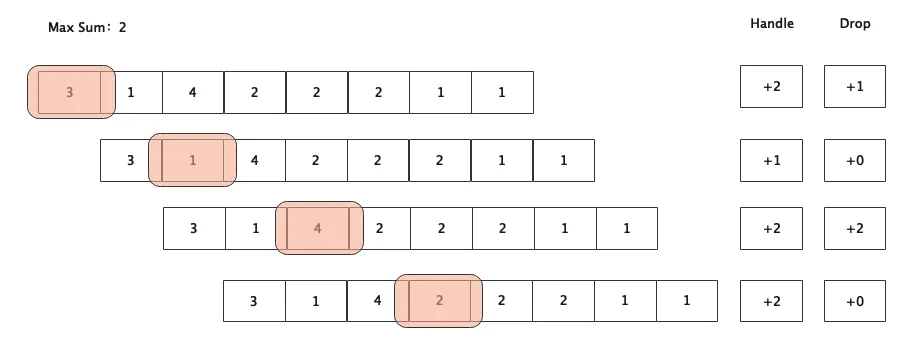
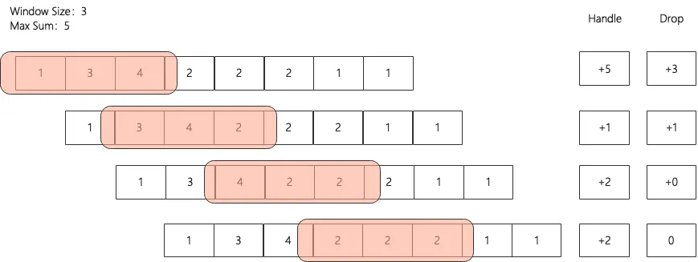
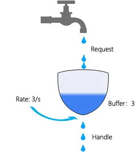
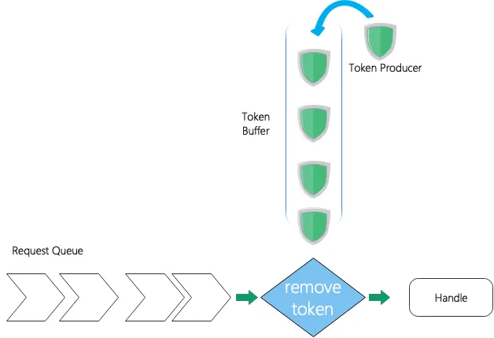
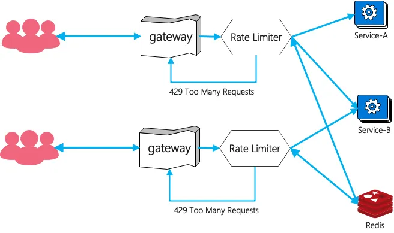

# 限流算法

## 固定窗口

固定窗口的逻辑很简单，假设一个窗口大小为1秒，容量为2，那么超过2的就丢弃，当时也会有其他的问题。如图前两秒服务器的负载来说是可以处理四个请求，可能会第一秒的第三个请求会处理的时间比较长一些，但是第一秒的一个请求被丢弃了，导致业务上有损耗，可见固定窗口足够简单但也具有一定的局限性，只关注当前的时间窗口，那是否可以灵活一些呢？

## 滑动窗口

窗口大小为3，每个格子为1秒，最大接收的请求是5：

- 第一个窗口，第三秒过来四个请求，`1 + 3 + 4 > 5`，所以第三秒的三个请求被丢弃，此时处理的请求为 `1、3、1`；
- 第二个窗口：第一秒已经过期了，第四秒过来了两个请求，但是此时窗口内未过期的请求为四个，所以第四秒只能处理一个请求，另一个请求将会被丢弃；
- 第三个窗口：第二秒的三个请求过期，此时窗口可以多处理三个请求，但是第五秒只过来了两个请求，所以完全可以都处理；
- 第四个窗口：第三秒过来的四个请求只处理了一个，所以此时第六秒过来的两个请求都可以处理；
- 大家以此类推：第七秒，第八秒的请求是否可以被处理，答案是可以的，大家可以自己推演一下。

最后可以算出来总请求数：16个，响应的请求：12个，丢弃的请求数：4个，窗口内最大的峰值：5。可以看到滑动窗口的处理更加的灵活一些，允许局部的出现峰值，但是通过滑动窗口可以保证一段时间内是稳定的，相对固定窗口并且可以处理更多的请求，起到了一定的削峰填谷的作用。

## 漏水桶

假设桶容量为 `3`，每秒流出的速率为 `3/秒`，假设：`1/3`、`2/3`、`3/3`处理请求，有如下请求过来：`1、2、4、2、2、2、1、1`

- 第一秒：立即进入一个请求，则可以完全处理；
- 第二秒：立即进入两个请求，也是可以处理的；
- 第三秒：四个请求
  - 如果在第三秒的时候 `1/3`秒前进入四个请求，那么桶还未来得及流出(处理)，`1 + 3 = 4 > 3`那么第四个请求就会被丢弃掉；
  - 如果第一个请求在 `1/3`秒前进入，并且第四个请求在的 `1/3`秒后进入，那么第一个请求已经被处理了，此时桶内的请求数应该是 `1 + 2 = 3 ≤ 3`，那么第四个请求就有可能被缓存在桶中，然后延迟到下一秒进行处理。
- 第四秒：
  - 第四秒的 `1/3`时候**前**进入两个请求，那么 `2 + 2 = 4 > 3`，就会有一个请求被丢弃；
  - 第四秒的 `1/3`时候**后**进入两个请求，那么 `1/3`的时候已经处理了一个请求了，此时桶内只有一个缓存的请求，`1 + 2 = 3 ≤ 3 `不会超过通容量，那么都会被处理了。
  - 如果此时桶内为空的：那么第四秒的两个请求都可以被处理；
  - 如果第三秒的后 `2/3`秒进入三个请求，那么只有一个请求会被处理，桶内缓存两个请求，第三秒的请求对第四秒产生了影响：

综上可以看出，桶排序某种程度上有点类似于固定窗口，不过带有了一个缓冲区，且对流量进行了整流，流量速率更加的均匀。从定义来看漏水桶满足 `FIFO(first in first out)`，那么可能就会一个请求被缓存的时间过长，导致所有等待请求都延时处理了，那么可以加一个超时淘汰机制，入桶的时候加入通时刻，在出口的时候加一个判断，如果超过了某一个时间，比如**超过1秒**，则直接丢弃，重新"**漏**"出来一个请求进行处理。

## 令牌桶

令牌桶与漏水桶类似，不过是当获取到令牌的时候才会进行处理，如果没有令牌则拒绝服务。当 `Token Queue`令牌的生产者会定时的往令牌队列中塞令牌，如果令牌满了则停止放入，当处理的请求有一定的并发的流量时，令牌桶是可以处理的，毕竟令牌桶中有一定的 `buffer`，整体上相对于漏水桶不仅可以满足平均速率处理还能够应对一定的突发流量。

这里就不细说了，大家可以结合漏水桶理解。另外令牌桶是一个典型的生产者-消费者的模型可以让实现更加的简单，通过控制生产者的生产速率可以动态灵活的控制限流，也可以通过 `Token Buffer`进行了解耦，可以同步异步之间可以进行灵活的转换。

## redis限流

redis限流适用于分布式的限流，那么使用Redis应该怎么限流呢？答案当然是 `ZSet`，使用请求的时间戳作为 `Score`，就可以拿到一个有序的队列，那么就可以结合 `滑动窗口`/`固定窗口`/`漏水桶`/`令牌桶`，进行限流，建议为限流单独搭建一个redis的服务，这样避免redis服务的负载过高导致限流组件延迟较大或者崩溃。

