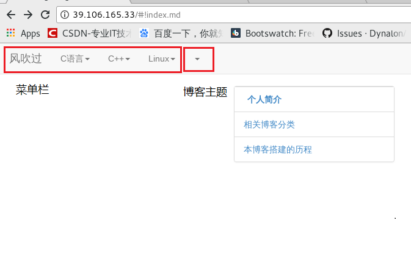
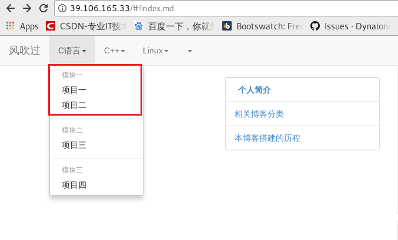
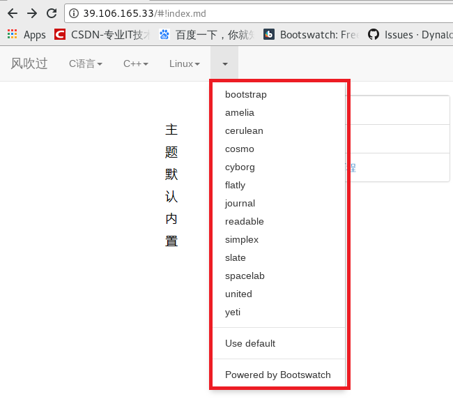

# 博客界面优化

参考文档:

[http://dynalon.github.io/mdwiki/#!index.md](http://dynalon.github.io/mdwiki/#!index.md)

https://blog.csdn.net/u012495579/article/details/53841930

http://www.360doc.com/content/16/0210/20/68780_533650380.shtml

https://blog.csdn.net/sinat_29774479/article/details/78404794


## 添加左上角的菜单栏和子栏

> 在项目的根目录下新建`navigation.md`文件，这个文件时本网页的配置信息，添加的信息内容为:
>
> ```
> # 风吹过
>
> [C语言]()
>
>   * # 模块一
>   * [项目一](subitem1.md)
>   * [项目二](subitem2.md)
>   - - - -
>   * # 模块二
>   * [项目三](subitem3.md)
>   - - - -
>   * # 模块三
>   * [项目四](subitem3.md)
>
> [C++]()
>
>   * # 模块1
>   * [项目1](xiangmu.md)
>   * [项目2](xiangmu.md)
>   - - - -
>   * # 模块2
>   * [项目3](xiangmu.md)
>
> [Linux]()
>
>   * # 模块1
>   * [项目1](xiangmu.md)
>   * [项目2](xiangmu.dm)
>
> [gimmick:themechooser ]()
> ```

> 先观察一下图片找一下代码的效果图，对应一下，很简单的，马上就能找到这个的语法了
>
> 
>
> 
>
> 
>
>  
>
> 第三张图片为最后一行代码产生的效果图`[gimmick:themechooser ]()`，这个代码的作用是切换不同的主题，虽然里面什么都没写但是我个人认为这个是调用的`index.html`中的代码，由于本人对前端一无所知，所以你懂。。。 。。。
>
> 

## 如何改变字体大小和颜色以及生成跳转链接

>字体变色和下面介绍下载的都是关于`html`的知识，但只是两个简单的语法，也很使用，太多的前端知识我也没学，但是我觉得这些我是够用了。
>
>字体变色用到的是`html`的一个标签`<font size=6 color="red">hello</font>`这段代码的效果如下演示:
>
><font size=6 color="red">hello</font>
>
>注意`=`，等号两边不要有空格，字体的颜色和大小，根据自己的需求可以该变，注意加`</font>`如果不加，你的剩下的代码都是该字体大小和颜色了。
>
>
>
>**生成跳转链接**，这个也相当的简单
>
>````
>[]()
>注释：中括号 + 圆括号 
>中括号：里面写链接的描述
>圆括号：写下一个markdown文件，例如[C语言页面](./C/index.md)
>那么你点击的时候，就会跳转到你指定的圆括号的链接的文件了了。
>````
>
##如何添加图片

>在`markdown`的语法中是有的，但是相必不一定看来，或许时间不够，所以我在这里直接列出来
>
>```
>
>注释：感叹号 + 中括号 + 圆括号 
>感叹号本人觉得就是固定语法为了和链接区分开而已，同时为了简单作用
>中括号：里面写图片的描述，也可以不懈
>圆括号：写图片的地址，可以是服务器的相对路径、绝对路径，甚至是一个网页上了图片链接都是可以的
>```
>
>添加完成后则可以看到效果图，这图片插图比较简单粗暴，如果想要添加文字环绕类的那种效果请学习前端方面的知识，本博客只是简单介绍，而且本人是一个"粗人"，也不太在乎这些东西。所以为了美观的效果可以考虑学习前端，如果学习前端的话就直接用`html`写了，所以简单的图片插入就着些了。

## 如何生成点击下载的效果

> 参考文档：https://blog.csdn.net/sinat_29774479/article/details/78404794
>
> 本人采用的第一种方法，奈何人品太差了，博客博主说的方法并没有成功，无奈只能把
> 文件压缩成`*.tar.gz`文件，去掉了`download`属性，方可下载。本博客采用的下载方式：
> ` <font size=6 >[本博客搭建的方法](./blog/博客搭建的方法.md)</font> <a href=`
> `"blog/博客搭建的方法.md.tar.gz"> <font size=6 color="red"> 点击下载文件</font></a>`
> 这段代码有长，但是剖析开就是给"点击下载文件"这几个字标记了属性而已
> 本博客采用的就是上述介绍的这种方法，如有不懂的地方，欢迎加首页群进行咨询。
